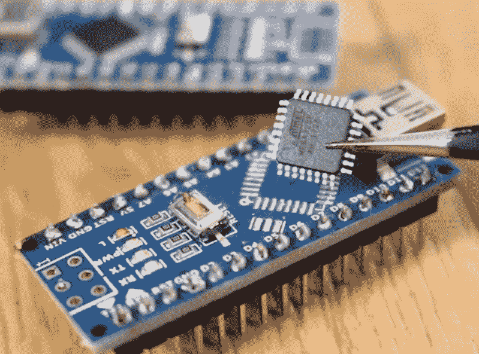

# 打造您自己的便携式 Arduino 烙铁

> 原文：<https://hackaday.com/2018/07/09/build-your-own-portable-arduino-soldering-iron/>

在这一点上，你几乎肯定见过这种低成本便携式烙铁，最好的例子可能是 TS100，这是一种口袋大小的温控烙铁，通常从海外供应商那里只需 50 美元就可以买到。无论你个人是否喜欢便携式烙铁而不是焊接站，事实是这些小烙铁越来越受预算有限或工作空间小的黑客和制造商的欢迎。

 相信模仿是最真诚的奉承，[【电子人】想出了一个 DIY 便携式烙铁，喜欢冒险的黑客可以自己制作](http://www.electronoobs.com/eng_arduino_tut32.php)。if 由 Arduino Nano 中的 ATMega328p 驱动，提供与 TS100 相同的软件定制选项，但价格要低得多。根据你的部件来源，你应该能以 15 美元的价格制造一个这样的熨斗。

熨斗采用定制 PCB 和 MAX6675 热电偶放大器来测量尖端温度。PCB 上的两个触摸按钮和一个 128×32 I2C 有机发光二极管显示器提供了一个基本的用户界面。在未来的版本中，[Electronoobs]说他将考虑添加某种传感器来检测熨斗何时被真正使用，并在不活动时让它休眠。

尖端来自廉价的焊接站替换铁，根据[electnoobs]的说法，它可能是整个结构中最薄弱的部分。他正在考虑使用替代的 TS100 吸头，但他说他需要重新设计他的电子设备，使其兼容。这个盒子是一个简单的 3D 打印的东西，看起来足够坚固，但在以后的版本中似乎可能会简化。

[这些年来，我们在](https://hackaday.com/2015/09/16/a-diy-mobile-soldering-iron/)[已经看到了很多 DIY 烙铁的尝试](https://hackaday.com/2012/04/16/diy-battery-powered-soldering-iron/)，但是我们不得不说，这一个可能是我们见过的最专业的。看看未来的修订如何在这个已经很强劲的初始表现的基础上有所改进将会很有趣。

 [https://www.youtube.com/embed/RNTs9bqowc0?version=3&rel=1&showsearch=0&showinfo=1&iv_load_policy=1&fs=1&hl=en-US&autohide=2&wmode=transparent](https://www.youtube.com/embed/RNTs9bqowc0?version=3&rel=1&showsearch=0&showinfo=1&iv_load_policy=1&fs=1&hl=en-US&autohide=2&wmode=transparent)

