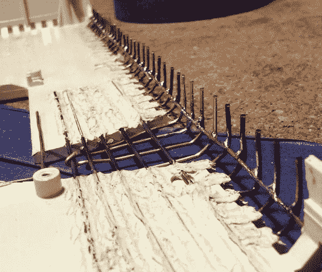
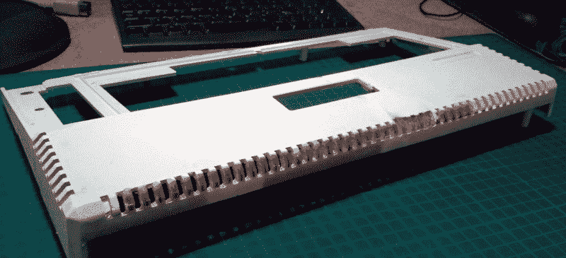

# 难以置信的雅达利 800XL 案例恢复

> 原文：<https://hackaday.com/2018/07/15/incredible-atari-800xl-case-restoration/>

如果你已经在 Hackaday 呆了一段时间，你就会知道我们发布的大部分内容都超出了大多数人认为合理的时间和精力水平。有人可能会说，这是一种观点:简单的出路很少是最令人兴奋和有趣的路线。我们，以及我们的读者，会被那些真正全心投入的项目所吸引。如果创造这个东西的人对它没有热情，我们为什么要有热情呢？

 话虽如此，有时，甚至我们也会对一些人的不择手段感到敬畏。一个完美的例子就是[Drygol]投入了大量的时间和精力来修复一台看起来像被卡车碾过的 Atari 800XL。[通过试验、错误和一堆聚酯树脂，他重现了雅达利盒子里丢失的整个部分](https://www.retrohax.net/extreme-refurbishing-episode-2-atari-800-xl-part-two/)。

为了开始这个过程，[Drygol]使用金属棒来桥接塑料完全消失的区域。通过用火炬加热棒，并把它们推进雅达利的盒子里，他能够创造一个坚实的工作基础。额外的棒然后被焊接到这些和弯曲，再创造原来的情况下的形状。修复的“框架”就位后，下一步是填充它。

[Drygol]从一个朋友那里借了一个完整的 Atari 800XL 外壳，并用它来创建自己外壳中缺失部分的模型。他的后面板大部分都不见了，所以需要做一些实验才能造出这么大的模具。最后，他使用了硅胶和一个定制的托盘，箱子可以垂直放置，但他提到他从未完全解决硅胶脱气的问题。模具仍然工作，但气泡造成的缺陷，需要在完成过程中手动填充。

 使用他的硅胶模具和同一个托盘，他能够将聚酯树脂倒在金属丝框架上。这让他大部分时间都在重建表壳，但在表面光洁度开始看起来不太好之前，仍然需要大量的填料和打磨。当他接近完成过程的最后阶段时，他使用自己制作的表壳表面纹理模具来粗糙化填充过程中留下的光滑区域。添加一些定制的喷漆，考虑到最初的情况，最终的结果看起来绝对惊人。

他在修复的第一阶段所做的工作已经给我们留下了深刻的印象，但这次的表壳修复真的达到了一个全新的水平。在这和[令人难以置信的教学视频【埃里克·斯特雷贝尔】之间](https://hackaday.com/2018/04/07/you-can-build-anything-out-of-what-is-holding-your-97-eagle-talon-together/)，我们真的对聚酯的力量有了全新的认识。

 [https://www.youtube.com/embed/ErKaUZmU6Jo?version=3&rel=1&showsearch=0&showinfo=1&iv_load_policy=1&fs=1&hl=en-US&autohide=2&wmode=transparent](https://www.youtube.com/embed/ErKaUZmU6Jo?version=3&rel=1&showsearch=0&showinfo=1&iv_load_policy=1&fs=1&hl=en-US&autohide=2&wmode=transparent)

