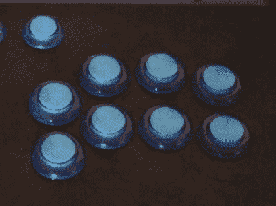

# Arduino 驱动的街机按钮灯光效果

> 原文：<https://hackaday.com/2018/07/20/arduino-powered-arcade-button-lighting-effects/>

如果你已经不再为是否应该建造自己的街机柜而苦恼，那么把这一条添加到令人信服的理由列表中，为什么你应该把不合理的物理空间用于玩你可能已经在手机上模拟的游戏。[Rodrigo]写信向[炫耀他的项目，为他的街机控制器](http://www.pakequis.com.br/2018/06/arcade-led-button-effects-arduino.html)上的发光按钮增添一些特色。([谷歌翻译](https://translate.google.com/translate?hl=en&ie=UTF8&prev=_m&sl=auto&tl=en&u=http://www.pakequis.com.br/2018/06/arcade-led-button-effects-arduino.html)

 这个项目的布线和你想象的一样简单:按钮连接到 Arduino 上的数字输入端，led 连接到数字输出端。当 Arduino 代码看到按钮被按下时，它会将相应的 LED 引脚拉高，并使用的 [SoftPWM 库启动淡出定时器。](https://github.com/bhagman/SoftPWM)

值得注意的是，实际的 USB 接口是用独立的控制器完成的，所以这里的 Arduino 纯粹是用来驱动灯光效果的。更挑剔的读者可能会说，你可以用一个微控制器完成这两项工作，但[Rodrigo]处于一种典型的“利用现有资源”的情况，并且手头已经有了一个 USB 控制器。

当然，没有东西放在里面，花哨的街机按钮不会给你带来什么好处。幸运的是[我们已经介绍了一些看起来很棒的拱廊橱柜](https://hackaday.com/2018/01/14/bartop-arcade-cabinet-build-skips-the-kit/)来激发你的灵感。

 [https://www.youtube.com/embed/pr0fkC3hq5E?version=3&rel=1&showsearch=0&showinfo=1&iv_load_policy=1&fs=1&hl=en-US&autohide=2&wmode=transparent](https://www.youtube.com/embed/pr0fkC3hq5E?version=3&rel=1&showsearch=0&showinfo=1&iv_load_policy=1&fs=1&hl=en-US&autohide=2&wmode=transparent)

