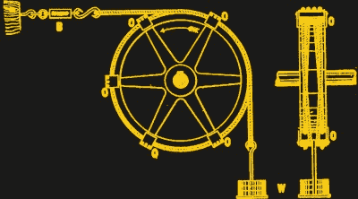

# DIY 微型 Dyno

> 原文：<https://hackaday.com/2018/07/22/diy-tiny-dyno/>

齿轮传动的 DC 马达已经成为现代初学者项目的面包和黄油。不幸的是，随着兜售这些机械奇迹的大量在线目录的出现，验证一款 DC 汽车将优于其他汽车的说法是一个挑战。

这就是我们的 Gerrit Coetzee 在着手批量购买这些齿轮马达时所面临的困境。在他的[初始拆卸](http://dammitcoetzee.com/2018/06/open-prony-part-1-initial-design-and-theory/)中，他迅速比较了设计上的变化，从拥有过载时延伸的两部分离合器的原始设计，到完全禁用该功能的克隆设计。

 然后，他继续研究测量电机输出的方法，在那里他发现了 Prony 制动器，这导致了绳索制动测力计。这就是事情变得有趣的地方，[Gerrit Coetzee]继续破解他自己版本的机器。这个想法是有一根绳子缠绕在由马达驱动的轮子上。绳子的一端连接到弹簧秤，另一端连接到悬挂的砝码，电机速度会影响弹簧秤上的力。这种由天平测得的力的变化可以用来计算马达的输出功率。

[Gerrit Coetzee]继续用弹簧代替砝码，用电子称重传感器代替秤，同时使用步进电机拉伸绳索，从而为绳子增加必要的张力。我们认为这是一个非常好的解决方案，整个实验可以电子控制。

这是一项正在进行中的工作，是一个很好的例子，说明如何将传统的实验适应现代。我们已经看到对更大的回收电机和带有许多传感器的[测力计的类似](https://hackaday.com/2017/12/18/a-dynamometer-for-measuring-motor-power/)[调查。](https://hackaday.com/2018/04/25/motor-test-bench-talks-the-torque/)