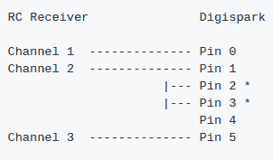

# 简单的 RC 转 USB 接口

> 原文：<https://hackaday.com/2018/07/24/simple-rc-to-usb-interface/>

随着无线电控制的爱好可以说比以往任何时候都大，对高保真电脑模拟器的需求也越来越大。无论你是想在下雨的时候能够“飞”起来，还是想在真正驾驶昂贵的四轴飞行器之前练习一下动作，你的电脑上有一个好的模拟器是下一个最好的选择。但是如果感觉不一样的话，模拟器不会给你带来太多好处；为了获得最佳体验，你真的需要把你的普通遥控发射器连接到电脑上。

【patr icio】来信与我们分享他通过 USB 将 RC 硬件连接到电脑的简单技巧。他的方法不是将发射器插入电脑，而是让接收器模仿 USB 操纵杆。这不仅更方便，因为你可以使用模拟器没有电线，但它将确保你的无线电硬件的细节(如响应滞后)在模拟中得到体现。

设置实际上非常简单。[Patricio]使用基于 ATtiny85 的 Digispark 开发板，因为这是他手头上的产品，但其原理在其他微控制器上也是一样的。只需将 RC 接收器的各种通道连接到数字输入引脚。RC 接收器为 5 VDC，电流非常小，因此甚至可以通过 USB 端口为整个装置供电。

在软件方面，Arduino 草图实现了您的期望。它循环监听输入引脚上的 PWM 信号，并将其映射到 USB 操纵杆位置信息。目前的代码只支持简单飞机设置的三个通道(X 和 Y 代表操纵杆，加上油门)，但是如果你需要更多的通道用于更复杂的飞机，那么应该很容易做到。

有关 RC 发射器和接收器交互的复杂性的更多信息，[请查看这项关于接收器延迟的有趣研究](https://hackaday.com/2018/02/26/quantifying-latency-in-cheap-rc-transmitters/)。