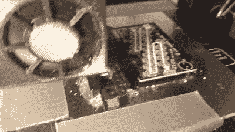

# 迷你垄断价格转换为挑选和放置(有点)

> 原文：<https://hackaday.com/2018/07/25/monoprice-mini-converted-to-pick-and-place-kinda/>

你会相信你可以把一台便宜的 3D 打印机轻松转换成一台全功能的取放机来帮助组装你的 PCB 吗？没有吗？很好，因为你不能。一个真正的拾取和放置需要各种传感器和逻辑来识别部件，旋转它们，确保一切都对齐，等等。你不可能把所有这些都装到一台便宜的 3D 打印机上，更别说缺少闭环控制了。

 但是如果你有一个*非常*具体的用例，即 PCB 只有一个相对较大的不需要旋转的单个部件，[西岛康纳]可能有一个解决方案给你。他买了一台 150 美元的 Monoprice Mini，加上一些打印零件，他就能够[制造一台机器，大幅缩短他制造 LED 板的时间](https://hackaday.io/project/159932-150-pick-and-place-machine)。最棒的是，这种修改不涉及对打印机的任何永久性改变，当他想打印什么东西时，他可以只弹出真空附件。

除了 3D 打印部件(在打印机本身上制作)，你唯一需要做的修改就是真空泵。[Connor]正在使用一个热空气站，其中包括一个用于拾取 SMD 元件的真空泵，但他提到您可能最好只是修改一个水族箱泵并使用它。一个印刷支架卡在 Monoprice Mini 的冷却风扇上，以固定真空吸尘工具，另一个印刷件固定 led 灯条和 PCB。值得注意的是，机器没有控制真空泵的能力，也不需要。捡拾工具非常脆弱，当 LED 落在焊膏中时，它会很好地粘在电路板上，以至于该工具无法将其提离。

这个版本中真正的天才来自手工编写的 g 代码。你从打印机的内置菜单系统中加载它，就像它是一个普通的 3D 打印一样，它会指示打印机将真空工具移动到 led 线上，拾取一个，并将其放在 PCB 上的适当位置。然后，它使用一个内置在真空工具支架中的小钉来推进 led 线，然后再次开始循环。令人难以置信的是，它对每块 PCB 进行了 20 次这种复杂的舞蹈，却没有任何反馈或校准检查。它之所以有效，是因为[Connor]愿意通过反复试验，让校准和 g 代码尽可能接近如此便宜的机器所能预期的完美。

这不是我们第一次看到 Monoprice Mini 被改造成比廉价 3D 打印机更令人印象深刻的东西。看起来，无论这台机器在印刷部门有什么不足，它[都远远弥补了它的可黑客性](http://hackaday.com/2016/07/07/modding-the-monoprice-mp-mini-printer/)。

 [https://www.youtube.com/embed/Us7oQIRNjYY?version=3&rel=1&showsearch=0&showinfo=1&iv_load_policy=1&fs=1&hl=en-US&autohide=2&wmode=transparent](https://www.youtube.com/embed/Us7oQIRNjYY?version=3&rel=1&showsearch=0&showinfo=1&iv_load_policy=1&fs=1&hl=en-US&autohide=2&wmode=transparent)

