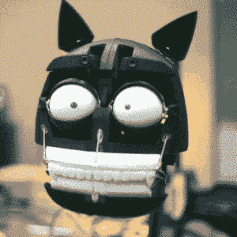

# 电子动画木偶从动画软件中获得线索

> 原文：<https://hackaday.com/2018/07/27/animatronic-puppet-takes-cues-from-animation-software/>

电脑动画角色的口型同步早已简化。你为你的角色所发出的元音和其他声音画出一组嘴唇形状，然后让计算机插入如何从一个形状到下一个形状。但是对于现实世界中的木偶，所有这些动作都必须一帧一帧地手动完成。或者他们有吗？

Billy Whiskers: animatronic puppet

定格动画制作人和黑客[James Wilkinson]正在做一个项目，涉及一个叫 Billy Whiskers 的真实世界毛茸茸的猫角色，并决定[Billy 的嘴唇将在计算机控制下使用伺服电机一次移动一帧](http://www.billywhiskers.co.uk/)，而[James]手动移动身体的其余部分。

在想出一种他想要的工作方式之前，他尝试了很多方法来制作这个唇形装置。嘴唇的形状是用吉他线焊接到其他线去伺服进一步回到头部。总共有四个嘴唇伺服系统和一个下巴伺服系统。没有太多的横向运动，但它足够了，并让大脑填充其余的部分。

在软件方面，他大量借鉴了用于唇同步计算机绘制字符的工具。他在 Adobe Animate 中创建了五个伺服电机的虚拟版本，并操纵它们来定义不同的嘴唇形状。Animate 然后在不同的形状之间进行插值，产生每一帧所需的伺服位置。他使用 AS3 脚本将这些位置发送给 Arduino。Arduino 草图然后使用 Firmata 库接收位置并移动伺服系统。正如你在下面的预告片中看到的，结果是完全令人信服的。我们还包括了一个视频，总结了他完成 Billy Whiskers 的迭代过程，或者只是查看他的详细网站。

[Jame]的工作表明，有许多方法可以制作定格动画，也许这是它如此有趣的一部分原因。其中一种方法是为每个角色形状 3D 打印一个单独的对象。另一个是制作剪纸并四处移动它们，这就是[【特瑞·吉列姆】为巨蟒组电影](https://hackaday.com/2018/03/29/cutting-paper-and-corners-in-animation/)所做的。然后是我们许多人第一次拿到相机时做的事情，在父母的厨房桌子上随意移动物体，一次拍摄一帧。

[https://player.vimeo.com/video/281605331](https://player.vimeo.com/video/281605331)

[https://player.vimeo.com/video/279080585](https://player.vimeo.com/video/279080585)