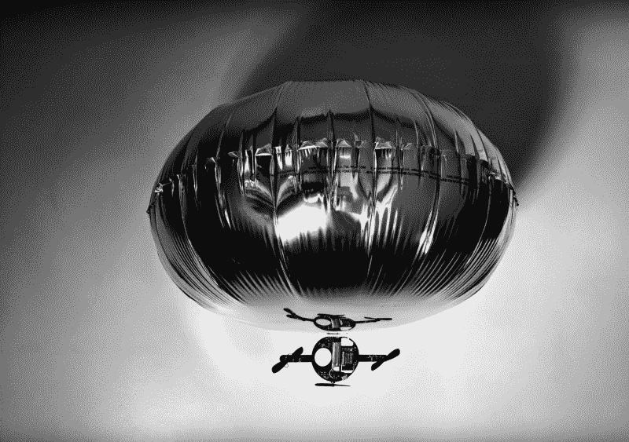
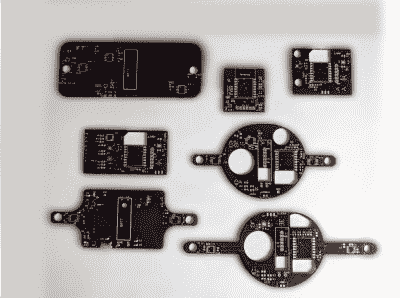

# 贝尔格莱德:索菲·克拉维茨的飞艇部队

> 原文：<https://hackaday.com/2018/08/02/hackaday-belgrade-sophi-kravitzs-blimp-army/>

 [https://www.youtube.com/embed/P3WLMx8qn9Y?version=3&rel=1&showsearch=0&showinfo=1&iv_load_policy=1&fs=1&hl=en-US&autohide=2&wmode=transparent](https://www.youtube.com/embed/P3WLMx8qn9Y?version=3&rel=1&showsearch=0&showinfo=1&iv_load_policy=1&fs=1&hl=en-US&autohide=2&wmode=transparent)

建造会飞的东西很难。对小型电池供电的无线电操作装置的限制已经提出了一个挑战，但增加重量，平衡和空气动力学的限制将它带到了一个全新的水平。Sophi Kravitz 在 2018 年贝尔格莱德 Hackaday 会议上的演讲中，从头到尾讨论了建造飞艇的每个挑战。

为 Hackaday 写作的乐趣之一来自于我们同事中难以置信的才华和经验。我们都在做自己的工作，但是我们会被那些和我们一起工作的人的工作所折服。我们的同事 Sophi Kravitz 的[遥控迷你飞艇](https://hackaday.io/project/25509-remote-control-mini-blimp)就是这样一个项目。这是一个包括障碍跑道和一组遥控软式飞艇的游戏。这一努力中的挑战一直在推动现有组件的极限。

## 比空气轻是一个沉重的负担

A pair of Sharpies weigh more than Sophi’s entire payload!

那么，为什么本质上是玩具飞机的东西会突破可能性的界限呢？称它为玩具并不能让飞行变得更容易。在这种情况下，小尺寸增加了难度。

索菲的游戏使用 1 米长的呼啦圈作为障碍，因为它们的尺寸可以很容易地作为行李放在商用飞机上。反过来，它们对可以通过它们的东西设置了尺寸限制，因为在软式飞艇的情况下，尺寸决定了它可以用于浮力的气体容量，也决定了它的设计的重量限制。她的氦气球只有 16 克的升力，她的机器需要吃特别严格的食物才能升空。机身、电子设备、电源、螺旋桨和马达等所有部件的重量都必须低于这个数字，而实现这一目标绝非易事。

## 动力管理

由于飞行器的重量在很大程度上取决于其组件，她向我们介绍了她在示意图中的选择，其中一些组件产生的陷阱，以及她采取的克服这些陷阱的步骤。出乎意料的是，由于完全可以理解的不喜欢 JST 连接器，她在板上包括了充电电路。然而，这种选择产生了一个意想不到的问题，因为其余的电子设备将抢走打算给她的电池充电的能量，而不是让电池充电。她用一个逆变器解决了这个问题，在充电时将飞行器的启动线拉低，尽管代价是另一个芯片。

The blimp, in all its glory.

她的第一个电源使用了 LDO 调节器，但当她发现一些间歇性通信问题是由低电源电压引起的时，就被一个降压-升压开关转换器取代了。似乎“LDO”中“L”的“低”还不够低，导致的功率下降对她的 ESP8266 来说太多了。类似地，她最初的电机控制器选择被证明不适合她电机所要求的绘制，并被替换为更好的选择。

## 选择电机

我们习惯于为四轴飞行器选择无刷电机和它们的螺旋桨，但 Sophi 制造的 4 毫米 DC 电机缺乏你通常可能期望的丰富的数据表。她不想买世界上所有电机的样品，所以买了一小部分进行评估。与四轴飞行器不同，它们配备了螺旋桨，但没有相关数据，被设计为风扇马达，而不是升力马达。因此，最终的电机选择是现实世界评估与黑暗中的轻微刺伤的混合。

Many PCB revisions on the way to a final blimp.

因此，在一系列版本之后，她有了一个 PCB，在两个臂上有左右电机，一个升降电机指向下方，她将它悬挂在氦气袋下面。她的控制器是足够简单的 3D 打印操纵杆外壳，内有另一个 ESP8266。blimp ESP8266 形成了一个控制器连接的无线网络。

Hackaday 社区第一次看到这个项目是在很早的时候，Sophi 在春季的都柏林会议上提出了这个项目。她欣然承认，还有一些工作要做，因为她的视频是许多拍摄中的第一个成功，但看到它取得真正的进展是非常有趣的。她给出了诱人的承诺，她可能会在未来的会议上展示它，这是一个我们几乎不能等待的前景！

* * *

不要错过今年 11 月的[黑客日超级大会](https://www.eventbrite.com/e/hackaday-superconference-2018-tickets-47386813234?aff=0802com)。专注于硬件创造，这三天充满了像这样的谈话，加上研讨会，徽章黑客，社区和更多。