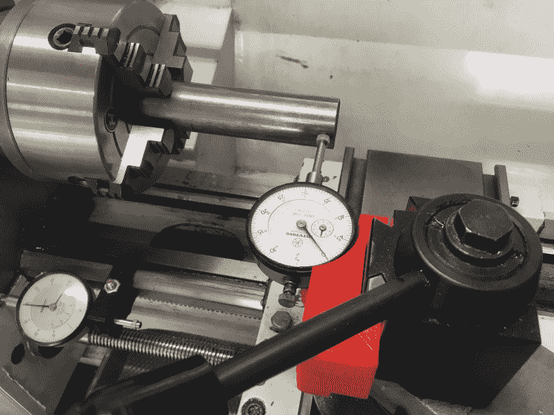
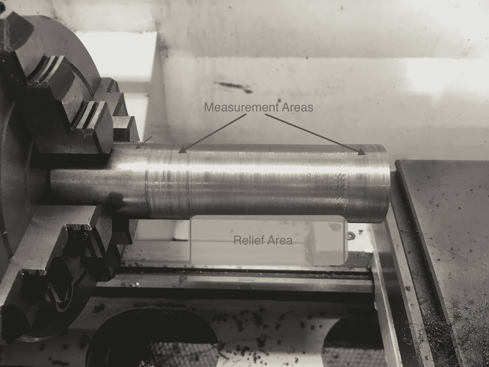
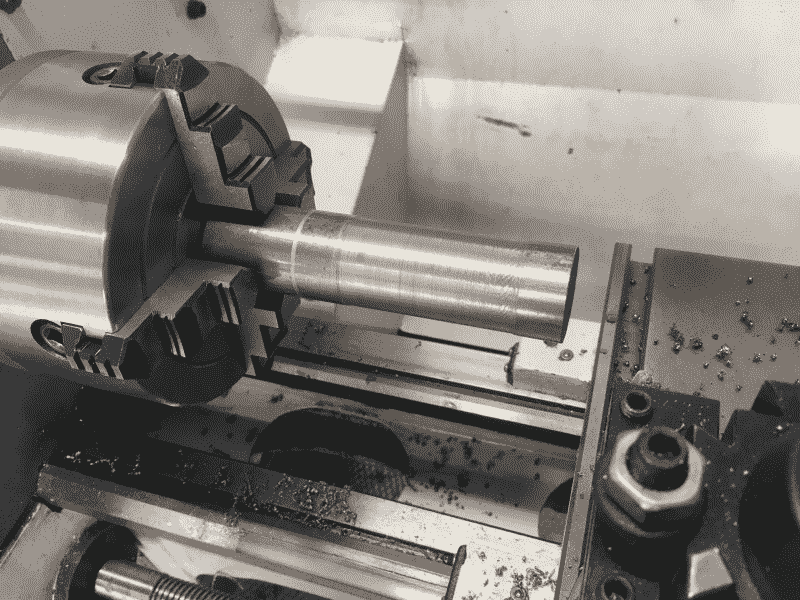
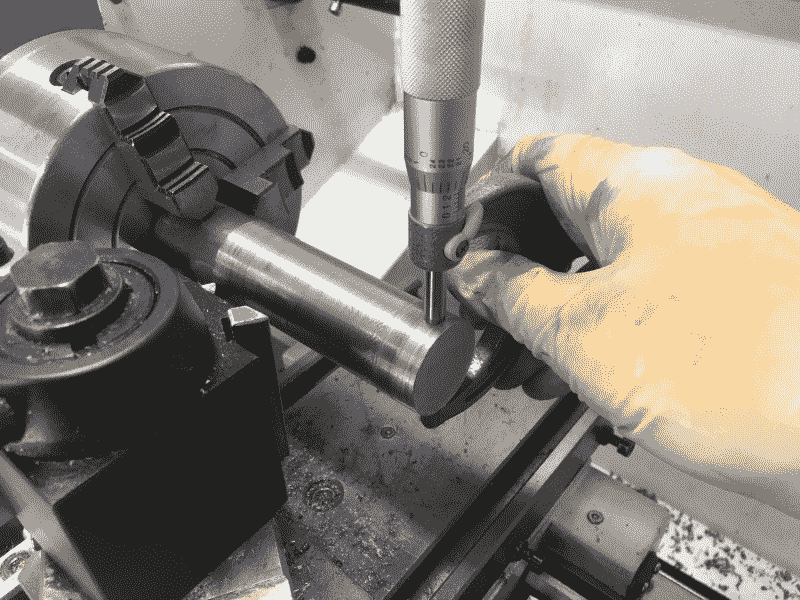
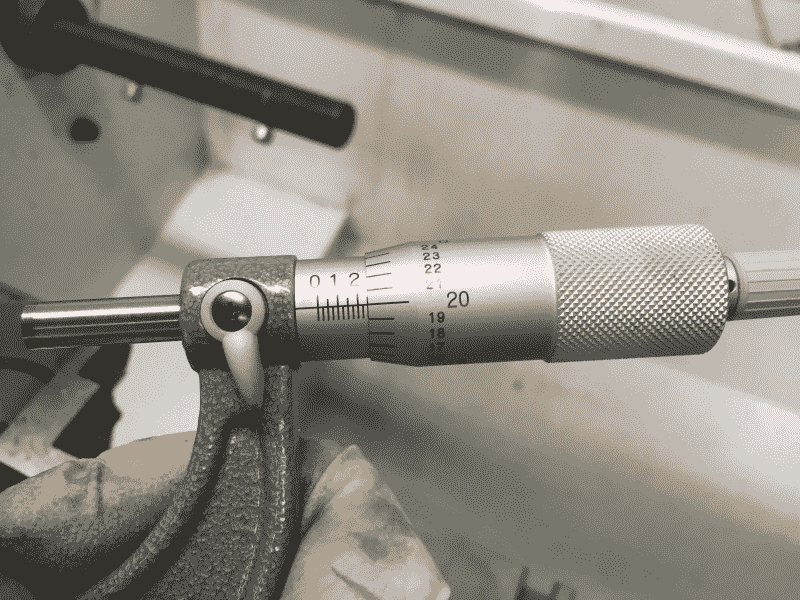

# 车床主轴箱对齐:切割测试棒

> 原文：<https://hackaday.com/2018/08/07/lathe-headstock-alignment/>

假设你最近[买了一台车床](http://hackaday.com/2018/04/24/lathe-features-you-should-choose-when-buying-your-first-machine/)并且[在你的店里安装了它](http://hackaday.com/2018/06/04/preparing-for-a-lathe/)。也许你已经走了，[像老板一样把它拉平了。你准备好做薯片了，对吧？嗯，没那么快。正如真正的机械师会告诉你，你可以使用所有的水平和激光和任何你想要的，但证据是在切割。精确调平可以让你的机器在大概范围内(机械师有*非常*小的大概范围)，但是让机器真正表现良好的最后一步是切割测试棒。这是消除床上任何扭曲痕迹的可靠方法。](http://hackaday.com/2018/07/10/the-machinists-mantra-level-thy-lathe/)

有两种类型的测试条。一个是检查主轴箱到导轨的对准，这就是我们在这里所做的。还有另一种类型用于检查尾座对齐，但这是另一天的主题。

我们先抛出一些股票。你需要一个大直径的东西，因为我们会有很多没有支撑的突出物，这是你通常不会做的。股票本身需要尽可能的刚性。突出越多，床扭曲的测量就越精确，但是如果突出太多，使原料在切割时无法保持刚性，测试就变得不可能。这是一种微妙的平衡。对于我的小型台式机器上的这个演示，我使用 1 英寸直径的股票，5 英寸长。对于大型落地式机器，直径为 2 英寸、长度为 10 英寸的原料是一个很好的起点。

I’m using my [3D-printed](https://www.thingiverse.com/thing:2830764) tool post indicator to dial in both ends. Within one thousandth will serve our purposes.

在四爪卡盘中尽可能靠近地将其拨入。我们现在消除的跳动越多，测试就越快越容易。如果你有一个机加工表面的股票，这是理想的，但从工厂冷轧股票一般是好的。我在这里使用低碳钢，但像 12L14 易切削钢会更容易获得良好的光洁度(这有助于测量)。

总的想法是我们在做一个杠铃形状。我们将在两端进行高精度切割，同时在中间留下一个我们可以轻松跳过的较窄区域。

随着股票拨入，把酒吧中心的救济区，留下大约一英寸左右的两端不动。我们只测量末端，所以中间部分会碍事。制作一个释放槽还可以最小化切削之间的刀具磨损(这会影响我们的测试结果)。3-5 万英镑的减免就足够了。我们需要足够的空间来清理两端的一些测试切口。不要放松太多，因为我们需要股票的刚性。

请注意，我们*不是*在这里使用尾板作为支撑。这一点很重要，因为尾板引入了自己的一组影响对齐的变量。我们*只*测试主轴箱对导轨的对准，所以我们*不能*使用尾座。这意味着我们必须进行非常轻微的切割，因为我们的刚性非常低。

Note that I got some nasty chatter towards the end of the relief cuts, because we’re way out past where we should be without tail stock support. Finish doesn’t matter at all for the relief area though, and I was impatient and cutting too aggressively.

有了浮雕，我们现在可以在两个测量区域进行*非常*的轻切割。我们希望能够完全清理表面(这样我们就知道我们在卡盘的跳动范围内)。我每次都要切 2000 刀。在两个测量区域通过，不要接触中间的交叉载玻片。在末端停止机器并进行测量，然后将支架向后卷，并根据需要进行另一次切割。

Between each pass, take a careful measurement of the two bands.

一旦你在两个测量区域都有一个干净的切口，用一个高质量的千分尺比较直径。如果它们不同，机器正在切割一个锥形，这意味着你的床有一些扭曲。调整或垫片车床的尾座结束脚一点点，并再次削减。

杆上较大的尾端意味着您的路径的右前角太低(刀具在移动时越来越靠近工件)。如果杆的卡盘端较大，则路径的右前角太高(刀具在行进过程中离工件越来越远)。

In my case, the two ends are dead nuts on at 1.245″, so I’m very happy. This machine can be trusted not to cut tapers within at least 6″ or so.

你想让这些测量值有多接近取决于你自己，但是千分之一比 5-6”对于一个业余爱好者需要的任何东西来说可能已经足够好了。完成后，你可以给测试棒上油并储存起来，以备后用。对于大约 30，000 的释放切口，相同的测试棒可以重复使用几次。

这就是全部了！切割测试棒是一个简单的长达一小时的项目，它将教会你宝贵的车床技能，并建立你对机器的信心。一旦你知道你可以信任这台机器，你就会知道任何未来的问题只存在于手轮和图纸之间。

*那是你。