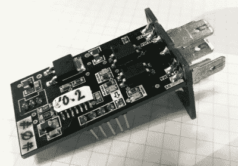

# 电压监控继电器不仅仅是看上去那么简单

> 原文：<https://hackaday.com/2018/08/03/voltage-monitor-relay-is-more-than-meets-the-eye/>

具有隐藏的次要功能的汽车部件通常仅限于卡通和迈克尔·贝电影，但[Jesus Echavarria]为客户创建的这个项目可能是我们在不久的将来最接近的项目。最终产品当然看起来像一个标准的汽车继电器，但在 3D 打印的外壳里可以看到一个令人惊讶的复杂的小装置。从技术上来说，它仍然是一个继电器，[，但它使用 PIC 微控制器来决定何时激活](http://www.jechavarria.com/2018/07/31/battery-monitor-on-a-automotive-realy-form-factor/)。

 【耶稣】接受了一项任务，要创造一种装置，它可以装进车辆的继电器盒，并作为电池监控器，在不同的电压设定点上启动。客户还希望能够配置诸如一旦超过电压阈值，设备在启用和禁用报警之前等待多长时间之类的事情。在向客户展示了一个使用 PIC16F88 和开关稳压器的超大原型后，他获得了继续开发更小、更具成本效益的版本的许可。

最终硬件使用 78M05 500 mA 线性调节器、PIC16F1824 微控制器和一对 AQY211EH 固态继电器。用于汽车继电器的标准五引脚布局允许监控器从车辆电池获得电源，同时提供两个输出通道，可以通过微控制器打开和关闭。[Jesus]说与客户的协议阻止他共享项目的一些元素(如固件源代码)，但他提供了足够的信息，因此创建自己的版本应该不会太难。

随着类似 ESP8266 的东西的加入，这可能是一种简单的方法来为旧车辆改装“智能”功能。例如，它可能允许通过 Wi-Fi 控制汽车的前灯和喇叭。或者你可以[黑进一个防盗系统](https://hackaday.com/2017/10/10/the-bane-of-aftermarket-car-alarms/)，除非你的智能手机先启动继电器，否则它会拒绝启动起动机或燃油泵。