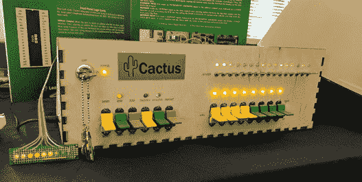
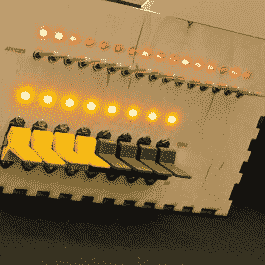
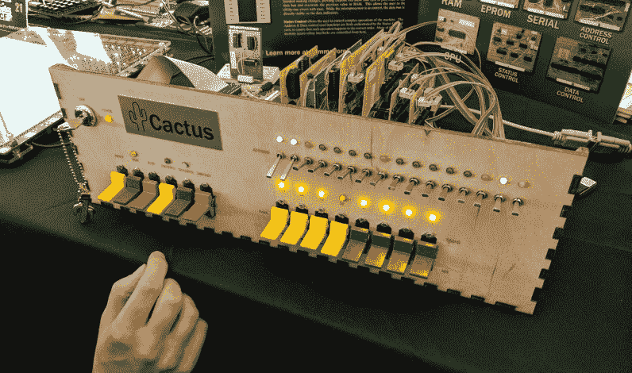

# VCF·韦斯特:给 6502 增加一个前面板

> 原文：<https://hackaday.com/2018/08/05/vcf-west-adding-a-front-panel-to-the-6502/>

当你想到 20 世纪 70 年代的老式电脑时，首先映入脑海的应该是装满开关、led 的前面板，如果你真的幸运的话，还有一把带钥匙的锁。在 70 年代的所有 CPU 家族中，你会发现 z80 和 8080 的前面板设置，但奇怪的是 6502 没有。这并不是说基于 6502 的计算机没有闪光灯和面板开关，但它们非常罕见。

如果某件事还没做，那就意味着必须有人去做。[亚历山大·皮尔森]建造了[仙人掌](http://commodorez.com/cactus.html)，一台基于 6502 的计算机，可以完全通过拨动开关和发光二极管控制。

如果你想知道为什么以前没有这样的东西，你只需要看看 6502 CPU 的电路。这种芯片的第一个版本是用 NMOS 工艺制造的，这些第一批芯片包括错误、未定义的行为，并且不能在停止时钟信号的情况下运行。这些问题在使用 CMOS 工艺的下一次芯片旋转中得到解决(这引入了新的错误)，但 6502 的 CMOS 版本将通过停止时钟信号来保留其寄存器的内容。

      

Cactus 计算机的规格是您对家酿 6502 系统的预期。该芯片是一个运行在 1MHz 的 WDC 65C02S，有 32k 的 RAM 和 16k 的 EPROM，双 6551 提供各种波特率的串行访问，并有来自 65C22 通孔的 16 位并行 I/O。ROM 加载了 OSI Basic。不过，真正的诀窍是前面板。十六个拨动开关允许前面板操作员在整个地址空间中拨动，八个翻转开关可以设置计算机中的任何位。其他控制包括运行、暂停、步进、检查和存放，正如您对任何前面板计算机的期望。

这是一件奇妙的作品，我错过了在东 VCF 的观看，所以我真的很高兴亚历山大能在两个海岸之间旅行。仙人掌确实是以前没有人做过的东西。不是因为这不可能，而仅仅是因为 6502 新出现时的技术水平不允许这样做。现在我们有了筹码，唯一的限制是找到愿意投入工作的人。