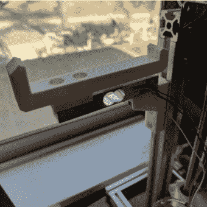
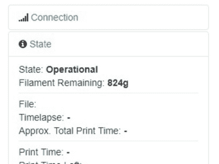

# 3D 打印机有了一个燃料表:给 OctoPrint 增加一个灯丝刻度

> 原文：<https://hackaday.com/2018/08/10/3d-printers-get-a-fuel-gauge-adding-a-filament-scale-to-octoprint/>

这似乎是一个足够简单的概念:随着 3D 打印机消耗灯丝，卷轴变得更轻。如果你称一个空的线轴，然后从正在使用的线轴的重量中减去它，你就会知道你还剩多少细丝。尽管这是一种在桌面 3D 打印机上获得“燃料表”的简单方法，但我们并不经常在 DIY 机器上看到它，更不用说消费硬件了。但是有了[Victor Noordhoek]的这个巧妙的技巧作为灵感，它可能会变得更加普遍。

他设计了一个简单的灯丝支架，安装在 HX711 称重传感器的顶部，然后连接到通过 SPI 运行 OctoPrint 的 Raspberry Pi。如果你在旧电脑上运行 OctoPrint，你需要使用一个中间设备，比如 Arduino 来连接它；不过老实说，你应该用圆周率。

    

在软件方面，[Victor]编写了一个 OctoPrint 插件，可以在主显示屏上显示当前细丝的重量。他对插件进行了大量的润色，努力添加了一个校准例程和一个字段，您可以在其中输入空线轴的重量，这样它可以自动从 HX711 的读数中扣除。

希望该插件的未来版本将允许用户输入他们特定细丝的密度，这样它就可以计算出剩余长度的估计值。下一个合乎逻辑的步骤将是添加一个检查，如果用户试图开始打印时需要的灯丝比传感器当前检测到的多，该检查将向用户显示一个警告。

这是 OctoPrint 提供的[难以置信的灵活性和定制化的又一个极好的例子。如果你正在寻找更多的理由来进行转换，请查看我们关于](http://hackaday.com/2018/01/03/upgrading-a-3d-printer-with-octoprint/)[使用 OctoPrint 创建令人印象深刻的打印延时视频的指南](http://hackaday.com/2018/07/02/coolest-way-to-watch-3d-printing-lights-camera-octolapse/)，或者[如何从你的移动设备上控制打印机](http://hackaday.com/2018/03/05/controlling-octoprint-on-the-go/)。