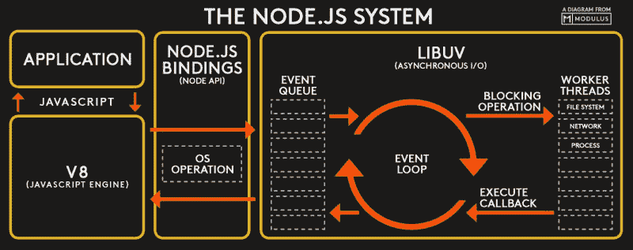
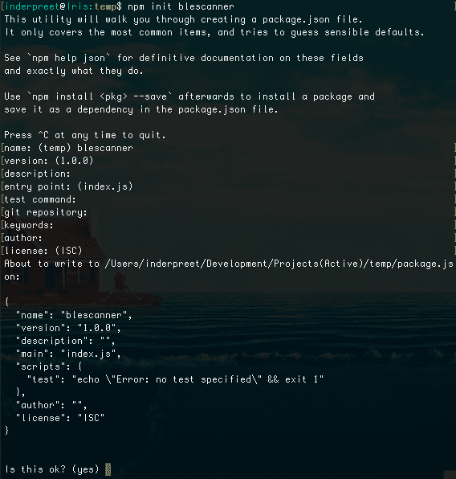
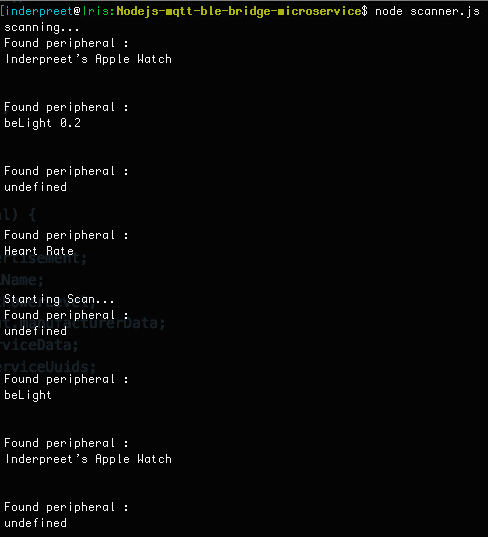
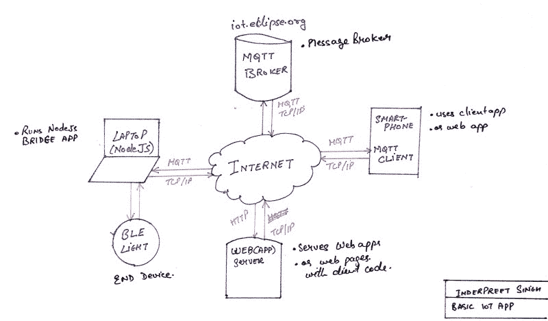
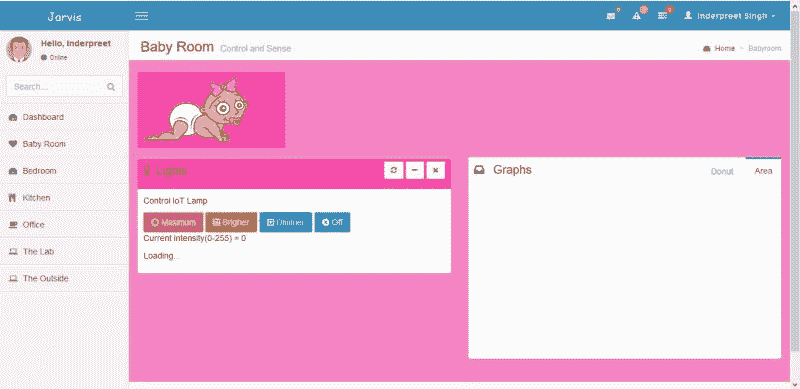

# 如何融合 BLE、NodeJS 和 MQTT 来实现物联网

> 原文：<https://hackaday.com/2018/08/24/how-to-mash-up-ble-nodejs-and-mqtt-to-get-internet-of-things/>

我们生活在互联设备的世界里。开发您自己的产品并实现您真正想要的功能，比忍受制造商选择的最低标准更容易。

在之前的一篇文章中，我遍历了一个小的 python 脚本来和一个 BLE 光对话，并用它来循环一些颜色。现在，我想更深入地研究联网 BLE 设备的世界，以及如何建立一个简单的物联网灯。有了这个例子，你能建造什么，它能做什么，天空就是极限。

休息之后，请加入我，我将演示如何使用 NodeJS 在数字世界和物理世界之间架起桥梁。

## 多种语言的蓝牙支持

NodeJS 与传统语言的不同之处在于，Node 在执行时被认为是异步的。NodeJS 使用一个事件循环，事件的发生是用户操作以及来自其他程序和线程的消息等事件的结果。传统的程序或脚本是一系列的动作，一个接一个地执行，直到所有的动作都完成。如果一个特定的动作被阻塞了，比如等待一个按钮点击或者一个来自设备的消息，那么程序将不得不等待直到这个过程完成。



Image source: [@BusyRich](https://mobile.twitter.com/BusyRich/status/494959181871316992)

我不是 NodeJS 方面的专家，但应该理解能够编写我们的应用程序的基础知识。Async.js 和事件循环的细节超出了本文的范围，我们将从一个基本的应用程序开始并添加必要的功能。

NodeJS 中的 BLE 支持是由 Sandeep Mistry 的“NobleJS”包实现的。通过研究已经使用该软件包的其他程序，您可以学到很多东西。我和阿历克斯·阿尔比诺讨论了他和 BLE 和诺杰的经历。Alex Albino 是我之前提到的 IMUDuino 的负责人，他的 web dashboard 应用程序是用 NodeJS 编写的。在 Kas Perch 和 Russell Hay 的帮助下，他在 [GitHub](https://github.com/femtoduino/imuduino-btle) 上还有许多其他的[示例应用程序。我从他们的工作中获得灵感，创建了一个这里描述的小型桥梁应用程序。它使用 NobleJS，既能在 MacOS 上运行，也能在 Linux 上运行。Windows 10 支持是可用的，但我没有冒险进入那个方向。](https://github.com/femtoduino/imuduino-btle)

让我们从一个基本的应用程序开始，以便更好地理解事物是如何工作的。

## 一个简单的 BLE 扫描仪应用程序

[noble js 包页面](https://github.com/noble/noble)有开始使用所需的所有必要文档。基本的安装说明很简单，包括我们在上一篇文章中安装的工具。要启动一个新项目，只需创建一个新文件夹并运行命令:

```
npm init blescanner
```

NPM 会问你一些问题，你只需要按回车键来输入你不想填写的内容。请注意入口点，默认情况下是 index.js。这是存放所有代码的文件。

接下来，安装 Noble 包:

```
sudo npm install noble --save
```

在您喜欢的编辑器中编辑 index.js。我已经有了开始使用的示例代码。如果您正在跟进，[复制这个 Github 要点](https://gist.github.com/inderpreet/460031cdeff7c40ea3e95380073df6a9)并粘贴到您的 index.js 文件中。

该代码有三个部分。首先是实例化包和创建变量。第二个是向 noble.on 事件等函数添加回调。第三个是一个小间隔循环，允许我们的程序启用和禁用 ble 扫描。一旦你运行这个脚本，它应该吐出你周围的 BLE 信标和外围设备的名称。我留下了一些未显示的数据供您试验。



## 与 BLE 之光对话

扫描仪能够打印附近所有外围设备的 id。我将我的扫描仪 index.js 重命名为 scanner.js，并运行它来扫描附近的 BLE 设备。一旦扫描器列出了 BLE 光源，我们就可以通过简单的复制和粘贴来创建一个 UUIDs 列表，以后可以对其进行修改。

我创建了一个新的 index.js，尝试连接到每个 BLE 灯，然后将一个已知的值写入相关的特性。与上一篇文章中我们编写了一个 4 字节的 RGBW 值不同，在本练习中，单个特征被用作概念验证。代码可以从[我的 Github 库](https://github.com/inderpreet/Nodejs-mqtt-ble-bridge-microservice)下载。

在我的实验中，我对每个灯使用值 00，因为默认情况下，BLE 灯在第一次通电时以最大亮度打开，因此成功连接的实例会关闭灯。

## 连通性–MQTT

有多种方法可以将我们的应用连接到互联网，使其成为物联网应用，但是，我们将采用 MQTT 协议。MQTT 是 Facebook Messenger 用于连接的相同协议，它是[家庭自动化](https://hackaday.com/tag/minimal-mqtt/)的最爱。

MQTT 通过一个叫做 MQTT 代理的中央邮局工作，这个代理允许客户端连接到它。一旦客户向代理注册了自己，它就订阅了一个特定的主题，相当于一个邮箱。一旦消息被发布到主题，它就被分发到注册的客户端。

需要做出许多决定，例如身份验证和确保交付，但重要的是每个客户端都要向外连接到代理。这意味着没有乱搞 IP 地址和防火墙设置(除非您的网络阻塞所有端口)。底层协议是 TCP/IP，有很多可以配置的地方，我把它们留给读者作为练习。

在这个练习中，我们将在 iot.eclipse.org 使用免费的 MQTT 代理，它不需要在 Eclipse 注册就可以使用，这非常棒。这可以被任何人用任何语言使用，甚至可以被专用硬件使用。我过去曾使用该服务将一台 CC3200 连接到互联网(我将在本文末尾简要讨论该项目)。

[有一个示例程序可用](https://www.npmjs.com/package/mqtt#example),我强烈建议您在继续之前先试用一下。只需将连接字符串替换为 mqtt://iot.eclipse.org，就可以开始了。此时，您已经有了两块拼图，已经测试完毕，可以开始工作了。接下来我们把蛋头放在一起。

## 创建一座桥梁

这里要做的最后一件事是创建实际的桥。这是它应该如何工作。



一旦 NodeJS 应用程序被执行，它应该尝试连接到 MQTT 代理。如果这失败了，我们应该得到一个错误，但是，如果一切按预期进行，应用程序应该订阅一个主题，并等待一个消息事件。此外，它应该检查机器上的 BLE 设备是否已启用，如果启用了，它应该开始定期扫描 BLE 设备。本地变量将用于存储要传输到 BLE 设备的 R、G、B 和 W 值。如果要扩展这个应用程序，可以使用更多的变量来保存 BLE 和我们的客户端应用程序之间交换的数据。

一旦在 MQTT 主题上接收到消息，该值就被写入本地变量，准备传递给 ble 设备。一旦找到 BLE 设备，应用程序应该连接到它并写入适当的特征。

这里需要做出一些设计选择。首先，我选择将本地数据刷新到 BLE 设备，即使它已经在之前的事务中被写入。这是多余的，您可以通过在此处添加一个检查来节省能源。其次，我有四个不同的主题，R，G，B 和 W，这意味着四种不同的连接。更好的方法是使用 JSON 或定制的数据打包方法将数据合并到一个流中。

那么现在我们如何发送命令呢？一个类似的只有 MQTT 部分代码的应用程序可以做到这一点，我也包括了它的源代码。[查看我的代码](https://github.com/inderpreet/Nodejs-mqtt-ble-bridge-microservice)，随意探索和分叉。我很想看看你用它做了什么。

 [https://www.youtube.com/embed/4mUCVHZFVtU?version=3&rel=1&showsearch=0&showinfo=1&iv_load_policy=1&fs=1&hl=en-US&autohide=2&wmode=transparent](https://www.youtube.com/embed/4mUCVHZFVtU?version=3&rel=1&showsearch=0&showinfo=1&iv_load_policy=1&fs=1&hl=en-US&autohide=2&wmode=transparent)


## 前端的简短注释

命令行工具并不是展示你的想法的最好方式，因为我们使用 NodeJS，我想我会简单地谈谈前端的话题。传统的应用程序必须用 Visual Basic 或 Java 编写(有人用 AWT 或 Swing 吗？)，然而 webapps 和相关技术可能是一种可移植的解决方案。代替可执行文件，网页可以被编码来显示必要的按钮，并具有 javascript 函数来发送必要的数据到类似 MQTT 服务器的东西。请记住，NodeJS 是用于后端的 javascript，相同的(ish)代码可以在现代 web 浏览器中运行。

需要更多灵感吗？看看 three.js 和 MeteorJS，你会发现自己有能力用很少的代码就能创建简单的 GUI 应用程序，你可以把它们移植到 Raspberry Pi 之类的程序中。

## 类似的项目

在结束之前，我想添加一个几年前我用德州仪器的 CC3200 平台做的一个小项目的视频演示。我没有让笔记本电脑运行 MQTT 代码，而是让 CC3200 连接到代理并等待命令。Benjamin Cabe 是整个 Eclipse PAHO 图书馆作为基地的灵感来源。对于前端，我使用 PAHO JS 库通过 MQTT 发送命令，获取状态消息并实时显示。



([外部链接](https://inderpreet.github.io/HomeAutomationUI/babyroom.html)到现场版)

这就是我现在所知道的，如果你喜欢你所看到的，告诉我们。我们希望看到您的项目由类似的技术支持，如果您有一些您觉得很神奇的东西，请随时通过提示热线向我们发送链接[。](https://hackaday.com/submit-a-tip/)

 [https://www.youtube.com/embed/0IOaaPuzCQU?version=3&rel=1&showsearch=0&showinfo=1&iv_load_policy=1&fs=1&hl=en-US&autohide=2&wmode=transparent](https://www.youtube.com/embed/0IOaaPuzCQU?version=3&rel=1&showsearch=0&showinfo=1&iv_load_policy=1&fs=1&hl=en-US&autohide=2&wmode=transparent)

