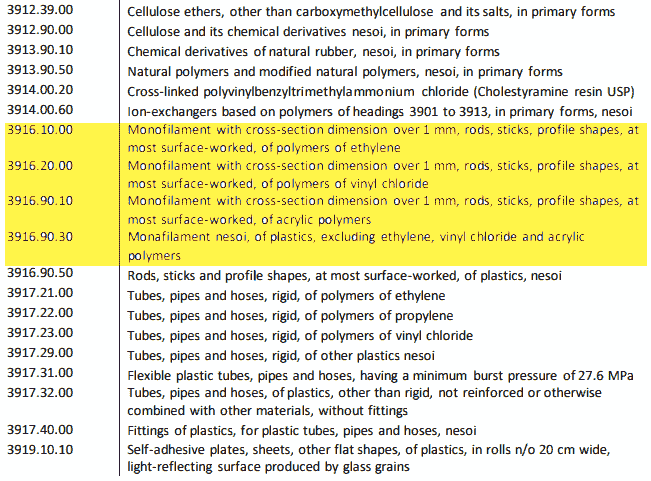

# 关税扩张将直接冲击 3D 打印

> 原文：<https://hackaday.com/2018/08/12/tariff-expansion-set-to-hit-3d-printing-right-in-the-filament/>

在关税实施仅仅几周之后，许多源自中国的电子元件的成本提高了 25%，第二轮关税计划开始实施，这将给黑客带来又一次打击。这一次，它击中了我们社区的核心:3D 打印。

快速浏览一下[美国贸易代表办公室](https://ustr.gov/about-us/policy-offices/press-office/press-releases/2018/august/ustr-finalizes-second-tranche)发布的[最终关税清单](https://ustr.gov/sites/default/files/enforcement/301Investigations/Final%20Second%20Tranche.pdf)，并没有发现明显的担忧原因。在列出的数百个具体项目中，没有一个会发现“用于添加制造的细丝”或任何其他表明 3D 打印用品被瞄准的东西。但隐藏在第二份关税项目清单中，楔入看起来像聚合物化学家的购物清单中的，是几个“横截面尺寸超过 1 毫米的单丝”条目。

这似乎是专门针对大多数 FDM 打印机喜欢吃的典型的 1.75 毫米灯丝；然而，细列项目具体列出了被禁项目，如乙烯、丙烯酸和氯乙烯的聚合物。最受欢迎的纤维 PLA 和 ABS 都不属于这些类别。然而，下一条似乎是这样的:“塑料单丝，不包括乙烯、氯乙烯和丙烯酸聚合物。”这似乎包括任何尺寸的塑料丝，由除上述聚合物以外的任何聚合物制成，这代表了一个广泛的产品类别，可以包括从钓鱼线到除草机线的线轴的任何东西。显然，PLA 和 ABS 打印机灯丝。

但是等等；情况变得更糟。不仅成品长丝显然被 25%的关税所涵盖，而且进入其生产的原料聚合物也被涵盖，ABS 和 PLA 在清单的其他部分都有自己的行项目。特别说明问题的是，这两个行项目都没有任何修饰词；没有提到形式或粘度或化学修饰，就像名单上的大多数其他聚合物一样。这似乎非常宽泛，似乎给了海关人员很大的自由，可以对任何装运的生 ABS 或 PLA 征收关税。对于从中国采购 PLA 和 ABS 的美国长丝制造商来说，这是个坏消息。

这些坏消息已经渗透到市场了吗？似乎不是；对 camelcamel 上的 [PLA 长丝价格历史的非详尽搜索显示，中国制造的长丝价格在过去几个月中一直稳定，因此市场尚未将关税考虑在内。随着关税将于 8 月 23 日生效，我们预计这种情况会很快改变。](https://camelcamelcamel.com/HATCHBOX-3D-Filament-Dimensional-Accuracy/product/B00J0ECR5I)

与任何关税一样，对消费者底线的影响很难预测。市场是灵活的，倾向于通过转换供应商和寻找新的做生意方式来适应面临的挑战。在这种情况下，除了中国以外的许多国家都生产 PLA 和 ABS，因此制造商可以在有意义的情况下转移供应商。但是，全球贸易是一个复杂的协议和联盟网络，通常不会考虑到小家伙。因此，你可以打赌，这一关税将对 3D 打印机灯丝定价产生影响。再过不到两周就要开始工作了，我们很快就会知道影响有多大。

感谢[Scott McGimpsey]的提醒。