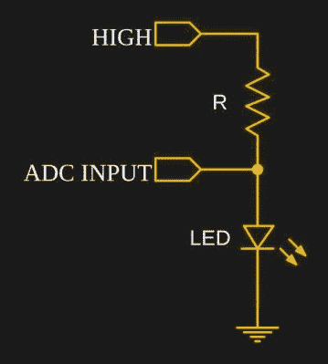

# 无需添加传感器即可熔断的 LED

> 原文：<https://hackaday.com/2018/08/21/an-led-you-can-blow-out-with-no-added-sensor/>

我们见过用按钮、开关、手势、电容触摸和红外遥控来实现，但从来没有像这样。[电子管道工]制造了一种可以像蜡烛一样吹灭的 LED，令人惊讶的是它不需要额外的传感器。该项目使用 Arduino 来演示如何打开和关闭一个微小的 LED，以响应被吹开的情况，唯一的组件是 LED 和一个电阻器。

 

【电子管道工】使用 0402 LED 和细导线来最大化温度响应。

这是怎么做到的？[electron_plumber]利用二极管(LED 中的“D”)的一个有趣特性，将 LED 本身作为温度传感器。二极管的压降取决于两个因素:流经二极管的电流和温度。如果电流保持恒定，则正向电压降会可靠地响应温度而变化。打开 LED 使其升温，吹着它使其降温，导致器件两端的压降发生可测量的变化。变化不大——只有几毫伏——但效果是一致的，可以测量的。这是[埃利奥特·威廉姆斯]最近深入探讨的一个原理:[使用二极管作为温度传感器](https://hackaday.com/2018/04/16/two-cent-temperature-sensors/)。

这是一个聪明的演示，有两个重要的细节使它工作。首先是 LED 本身；[electron_plumber]使用一个安装在两根电线上的微小的 0402 LED，以便最大化对其吹气所引起的温度变化。第二种是更可靠地检测仅仅几毫伏变化的方法。通过对 Arduino 的 ADC 进行过采样，可以在不增加任何硬件或改变基准电压的情况下获得更高的分辨率。代码不是读取 ADC 一次，而是读取 ADC 256 次，并将读数相加。通过处理更大的数量，可以捕获到在单次读取中无法可靠记录的累积更改，并对其采取行动。更多细节可从[electron_plumber]的 [GitHub 储存库获得，该储存库将 led 用作传感器](https://github.com/paulhdietz/LEDSensors)。

下面嵌入的是一个视频，它既精彩又简短。它演示了实际的项目，采用了“展示，不要说”的方法，并且没有超出它需要的长度。

 [https://www.youtube.com/embed/TD6A_tvbKT0?version=3&rel=1&showsearch=0&showinfo=1&iv_load_policy=1&fs=1&hl=en-US&autohide=2&wmode=transparent](https://www.youtube.com/embed/TD6A_tvbKT0?version=3&rel=1&showsearch=0&showinfo=1&iv_load_policy=1&fs=1&hl=en-US&autohide=2&wmode=transparent)

过去，我们已经看到发光二极管可以像蜡烛一样以不同的方式吹灭；一个[用麦克风检测吹风](https://hackaday.com/2017/01/05/blowing-out-a-candle-flicker-led-the-death-of-flame/)，另一个[用热敏电阻](https://hackaday.com/2008/07/11/breath-controlled-led-candles/)检测吹风时的温度变化。[electron_plumber]的项目引人注目，不仅因为没有使用额外的部件，而且因为以任何人都可以启动和运行的方式记录，这是我们一直希望看到的。