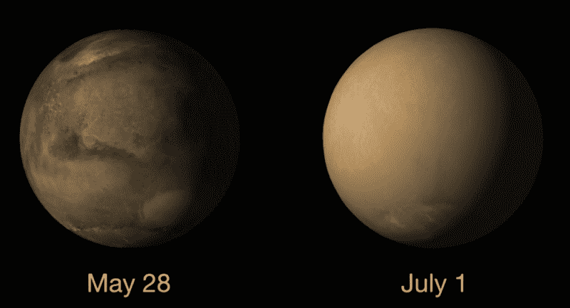
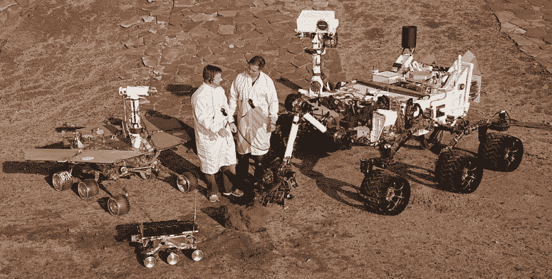

# 火星尘暴可能给漫游者带来厄运

> 原文：<https://hackaday.com/2018/08/28/martian-dust-storm-may-spell-doom-for-rover/>

每个人都知道太空是一个非常不适宜居住的地方，但是火星的表面也好不到哪里去。这是一个昏暗、寒冷、干燥的世界，一缕大气提供的气压不到地球大气压的 1%。由于行星的核心不再为它提供磁层，宇宙射线和强烈的太阳耀斑使表面沐浴在辐射中。没有足够的环境屏蔽，人类在地表生活是不可能的，正如美国宇航局的漫游者舰队可以证明的那样，机器人访客也不能完全免受地球的挑战。

Opportunity Mission Patch

随着一场全球范围的沙尘暴最终开始平息，美国国家航空航天局(NASA)正竭力查明这颗红色星球是否又有一名受害者。自从 6 月 10 日风暴开始之前，该机构就没有收到 2004 年登陆火星的机遇号 T2 号火星车 T3 的消息；每过一天，重新建立联系的机会就会减少。虽然他们还没有完全放弃希望，但毫无疑问，这是卡丁车大小的火星车在地表度过的近 15 年中面临的最大威胁。

机遇号设计有几个自动防故障系统，这些系统应该在风暴中启动，尽可能地保护火星车。但是即使有了这些系统，它的孪生兄弟*号*在 2010 年也遭遇了类似的情况。机遇号能通过最近的挑战吗？还是这一全球性的天气事件让这项长期的任务戏剧性地结束了？

## 晴天漫游车

甚至在海盗 1 号于 1976 年在火星表面着陆之前，人们对火星表面的情况就已经相当了解了。由于火星表面接收的阳光只有地球的 40%左右，早期的任务使用放射性同位素热电发电机(RTG)来提供电力，而不是依赖当时低效的太阳能电池板。不幸的是机遇号没有 RTG，必须依靠太阳能给电池充电。

但是，即使太阳能电池板在后来的火星任务中变得越来越小，效率也越来越高，但它们上面不断积累的灰尘意味着随着时间的推移，它们提供的能量会越来越少。因此，任何在火星上使用太阳能电池板的东西，如果想有任何存活的机会，都需要设计一定的安全措施。当“机遇号”和“T2 号”火星车被设计的时候，它们经历长时间黑暗的可能性就被预料到了。

当漫游车检测到电池电量不足，太阳能电池板没有产生足够的能量来充电时，它将触发低电量故障。这导致漫游车关闭系统并进入“休眠”模式，直到太阳能电池板再次开始发电。这种模式足以在火星上偶尔出现的沙尘暴中保护火星车，但这不是常规的沙尘暴。

View of dust storm from Mars Reconnaissance Orbiter (MRO)

## 前所未有的事件

美国宇航局知道机遇号会在风暴开始后不久进入休眠状态，大约在六月中旬。这将是预期的行为，通常一旦风暴散去，电池板开始接收阳光，漫游车将恢复正常运行。但在这一点上，漫游者已经在黑暗中太久了，美国宇航局认为电池已经或接近零，这意味着所有系统已经完全关闭。

这使事情变得复杂，但仍然不意味着*机会*不可挽回。最终，足够的阳光会照射到电池板上，系统会自动恢复供电。但是没电的时间会导致车载时钟重置。如果发生这种情况，漫游者将试图利用火星的日出和日落来获得基本的时间感。这种情况的现实是，当美国国家航空航天局期待的时候，来自*机遇号*的预定传输将不会发生。如果美国国家航空航天局不知道什么时候会发生，将需要[通过深空网络](https://hackaday.com/2017/07/21/serious-dx-the-deep-space-network/)进行非常仔细的观察，以尝试接收来自*机会*的传输。

更糟糕的是，在与地球失去联系足够长的时间后，漫游者会开始怀疑自己。最终将记录一个“上传失败”故障，这将触发*机会*开始对其通信系统进行诊断，并尝试使用替代传输模式。这将使它更难收到漫游者回家的电话，因为美国宇航局不知道它何时甚至如何制造。

## 不确定的未来

除非它在风暴中被真正掩埋，否则美国宇航局相信一旦光线水平恢复到季节性正常水平，机遇号将会醒来。接收它的信号可能会很困难，但凭借该机构在地球和火星轨道上的资源，这不一定是一个结束任务的挑战。诚然，这是最糟糕的情况了，[，但这从未阻止美国宇航局在](http://hackaday.com/2018/07/31/kepler-nears-end-of-epic-journey/)之前。

虽然即使一切顺利，美国宇航局能够与机遇号重新建立双向通信，但火星车可能会受到致命的打击。人们越来越担心，这种前所未有的深度放电加上风暴期间的低温可能对火星车的锂离子电池产生了负面影响。如果电池组的容量已经减少，它们可能不再能够运行任务关键型系统。在即将到来的火星冬季，运行火星车上的加热器尤其令人担忧。

## 彻底的成功

Opportunity (Left) and Curiosity (Right)

机遇号是目前运行时间最长的火星探测器，比它最初的任务寿命延长了近 60 倍。即使它永远不会醒来，或者如果它只是返回到部分功能状态，这项任务仍将作为有史以来最成功的星际探索之一载入史册。从这个角度来看，潜在的失去*机会*不应该被认为是令人失望的。如果说有什么不同的话，那就是火星号不得不倾其所有撞向这辆经验丰富的火星车，让它停止工作，这或许是一次合适的退役。

无论如何，科学将继续在火星表面进行。更大更现代的好奇号火星车使用了 RTG 技术的进化版本，该技术为 T2 海盗号着陆器提供动力，因此能够在风暴中工作。[在今年年底之前，洞察号着陆器](http://hackaday.com/2018/05/18/insight-brings-new-tech-to-mars/)将加入它的行列，取决于你相信谁，我们[可能会在十年内投入使用](https://hackaday.com/2017/08/17/living-on-mars-the-stuff-you-never-thought-about/)。对于火星探索来说，这是一个非常激动人心的时刻，无论发生什么，机遇号将作为人类红色星球之旅的一个重要里程碑而被永远铭记。