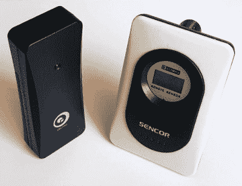

# Raspberry Pi As 433 MHz 至 MQTT 网关

> 原文：<https://hackaday.com/2018/08/29/raspberry-pi-as-433-mhz-to-mqtt-gateway/>

许多低成本无线温度和湿度传感器使用 433 MHz 发射机将数据发送回基站。这对所述设备的制造商来说是一个很好的选择，因为它很简单，而且无线电很便宜，但是它确实限制了我们作为消费者可以用它做些什么。一般来说，你不会在你的电脑上从这些传感器读取数据，除非你有一个 SDR 设备和一些 GNU Radio 和阅读 Nexus 协议的经验。

 但是【Aquaticus】已经开发了一款非常全面的软件，只要你有一个备用的树莓派，它就可以让你更容易地将这种类型的传感器集成到你的家庭自动化系统中。[称为 nexus433，它使用一个廉价的 433 MHz 接收器连接到 Pi 的 GPIO 引脚，使用流行的 nexus 通信协议从环境传感器](https://github.com/aquaticus/nexus433)接收数据。项目文档中列出了一些已知的兼容传感器，其中一种传感器的运费仅为 5 美元。

除了将传感器的温度、湿度和电池电量值发布到 MQTT 之外，它甚至跟踪每个传感器的连接质量以及它们何时上线和下线。可以肯定的是，这不是一次简单的黑客攻击。在 nexus433 中，[Aquaticus]已经创建了一个成熟的 Linux 服务，具有足够的灵活性，无论是家庭助手还是您自己组装的东西，您都应该不会有任何问题。

我们已经看到许多家庭自动化黑客使用这些无处不在的 433 MHz 无线电，[从用 ESP8266](https://hackaday.com/2016/05/01/minimal-433-mhz-web-home-automation/) 控制它们到将[流行的 TP-LINK 路由器黑进低成本家庭自动化集线器](https://hackaday.com/2016/10/26/converting-a-tp-link-router-to-mission-control-for-cheap-433mhz-home-automation/)。