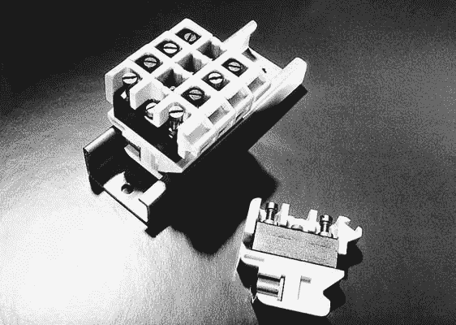
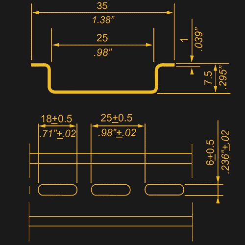

# 餐车栏杆以及它是如何形成的

> 原文：<https://hackaday.com/2018/09/13/the-din-rail-and-how-it-got-that-way/>

除非你在工业电气领域呆过一段时间，否则你可能会对运行工厂等所需的各种控制面板的集成度感到惊讶。看看世界上几乎任何地方的任何机柜内部，你都会看到一排排整齐的塑料接线板、断路器、信号调节器和各种计算硬件，从可编程逻辑控制器到 Raspberry Pis 和 Arduinos。

一个精心制作的工业控制面板可以真正成为一件美丽的东西。但是，在橱柜中所有电气元件的后面，在所有布线整齐、标签清晰的电线下面，有一条不起眼的金属带将它们缝合在一起:DIN 导轨。它是如何产生的，为什么它如此普遍？

## 请给我标准

后来成为 DIN-rail 以及安装在其上的接线板和附件的发展与工业电气化的早期阶段密切相关。随着电机和其他部件在工业中变得越来越重要，也需要一些合理的东西将所有东西连接在一起。早期的控制面板是任何能找到的终端的大杂烩，通常是某种权宜绝缘体中的普通螺母和螺栓。面板建造繁琐，难以维护，而且容易出故障。

The original Hugo Knüman “RWE Terminal Block” and rail. Source: [Phoenix Contact](https://www.phoenixcontact.com/online/portal/us?1dmy&urile=wcm%3apath%3a/usen/web/corporate/Company/subcategory_pages/Our_history/ca883b0c-2ba8-4eac-8325-9a5830669032)

为了缓解这些问题，1928 年，德国一家名为*rhein isch-westf lisches elektrizitswerk*(RWE)的电力公司与一家电气产品供应商签订合同，开发一种新型模块化端子板系统。这家年轻的公司名为*phonix elektrizitsgesellschaft*，其创始人 Hugo Knümann 与来自 RWE 的工程师密切合作，解决了接线板问题。( *Ordnung muss sein* ！)

他们想出的是一个装有金属汇流条的小瓷盘。这根棒通过螺丝端子将两根电线连接起来，瓷板牢牢地固定住了它。砌块被设计成紧密地包装成长条，但是只有砌块的一面被陶瓷封闭，需要一些方法来防止短路，以防相邻的砌块被意外地向后安装。这一要求，加上需要牢固地安装金属条，但仍允许拆除和重新定位，导致了一个优雅的解决方案:一个不对称的金属轨道，块可以夹在其中。G 形轮廓将提供牢固的机械连接，允许接线板沿着轨道横向滑动，以允许精细的位置调整，并且重要的是，防止向后安装。

“Top-Hat” rail, under EN-50022\. Source: [Anixter](https://www.anixter.com/en_us.html)

与许多创新一样，第一个提出设计的人会设定标准，Knümann 设计成为第一个电气设备装配导轨，这是导轨的通称。G 型轨和部件很快被其他制造商采用，一个行业诞生了。G 形截面后来被“礼帽”轨道连接，这是一种对称的轮廓，更适合于较轻的部件，并最终变得非常受欢迎，以至于许多端子板都与 G 形和礼帽轨道兼容。C 形截面轨道也被开发用于某些应用。

型材的尺寸和机械规格在 20 世纪 50 年代根据德国标准协会(d in)发布的各种不同标准实现了标准化。这些标准在过去几年中有所调整，并扩展到其他欧洲和国际监管机构。北美电气制造商协会(NEMA)也采用了相同的标准，如今，DIN 导轨已成为真正的全球标准。

## 摇起来

除了为外壳提供接地连接的特殊端子，DIN 导轨上的电气动作完全与导轨金属隔离。这意味着 DIN 导轨型材的大部分规格都是纯机械的，以确保安装的端子板固定不动。鉴于 DIN 轨道板经常在铁路和工厂等极端环境中投入使用，轨道承受振动和机械冲击的能力至关重要。事实上，一旦实现标准化，铁轨的早期用途之一就是用于德国的第一批核电站，这是一项非常苛刻的应用。该标准规定了 350 克的冲击和 5 克的振动阻力

耐腐蚀性也是 DIN 导轨工作的一个重要部分，考虑到钢通常是型材的首选材料，尽管也使用铝，但也不排除其他材料，因此需要某种涂层。铬酸盐处理是选择的过程，这是使用铬溶液的化学过程。大多数 DIN 导轨曾经具有六价铬处理的黄金铸造特性，但是截至 2006 年，欧盟关于减少有害物质(RoHS)的规定和美国 OSHA 法规导致制造商转向三价铬，这给底层镀锌钢带来很少颜色，因此呈现银白色。

如果你在任何 DIN 导轨配件目录中查找，比如雨果·尼曼创办的 Phoenix Contact 公司，你会发现一系列令人眼花缭乱的产品可以混合搭配，几乎可以做任何电气工作。对于电气工程师来说，这真的只是一个乐高积木，这都是因为需要整理东西，并给这个领域带来一些标准。

【特色图片:[高级系统设计有限责任公司。](https://asdllc.us/) ]