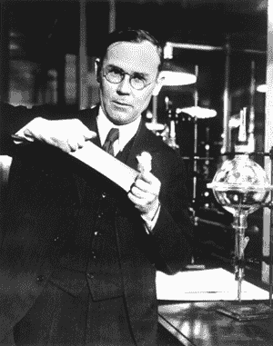
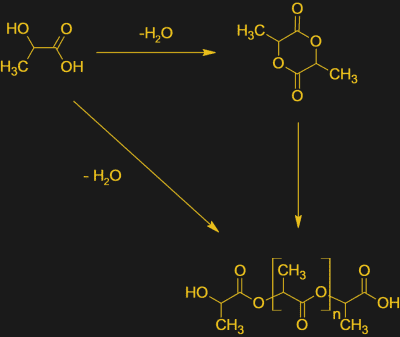
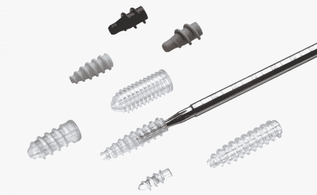

# 解放军:成长中的塑料

> 原文：<https://hackaday.com/2018/09/12/pla-the-plastic-that-grows/>

如果你曾经驾车横穿美国，有一件事一定会给你留下深刻印象，那就是我们这里种植的数量惊人的玉米。如果你走北线——我已经走了七次，所以我烂熟于心——你会看到从俄亥俄州到蒙大拿州除了玉米什么都没有。田地的面积大得惊人，你不禁会想，“我们真的会吃掉所有的玉米吗？”

简单的回答是不，我们没有。我们种植的玉米远远超过我们的食用量，或者说，一旦转化为酒精，我们就可以饮用。我们确实喂了很多动物，其中很多后来都变成了汉堡或猪排。但即便如此，在计入出口后，我们仍有大量玉米可以利用。不过，这些剩余的玉米有很多工业用途，而且很有可能你的 3D 打印机旁边就有一两只耳朵，以聚乳酸(PLA)的形式存在。

## 忘记化石吧

我们大多数人很少考虑塑料是从哪里来的，那些考虑的人很可能认为塑料来自石油。在聚合物行业的大部分历史中，这是一个安全的赌注，但随着工程生物塑料的相对较新的引入，该行业有了新的原料:最近死亡的植物，而不是化石植物。(这不包括取自自然的生物聚合物，如纤维素和乳胶，它们或多或少被直接使用；大自然是一个非常优秀的聚合物化学家。)

Wallace Carothers invented PLA, but DuPont never commercialized it. Source: [Wikipedia](https://en.wikipedia.org/wiki/Wallace_Carothers)

无论生物聚合物是天然产生的还是工业合成的，基本原理都是一样的。所有的聚合物都是由称为单体的小的重复单元组成，这些单元通过化学方式连接成长链。非生物聚合物的一个简单例子是聚乙烯，其中单体是两碳烯乙烯。单体的性质、数量和链的配置在很大程度上决定了最终塑料的特性，这些因素的大量组合导致了当今使用的聚合物的惊人多样性。

虽然聚乳酸——由于单体是乳酸，所以更正确的称呼是“聚乳酸”——只是在相对较近的时间才得到广泛应用，但它的历史可以追溯到 20 世纪 30 年代。不出所料，这是特拉华州威尔明顿 E.I. du Pont de Nemours 公司庞大的研究实验室的又一个产品。这也是华莱士·卡罗瑟斯(Wallace Carothers)的发明，这位麻烦缠身的天才发明了尼龙和氯丁橡胶，这或许有点令人惊讶，因为这些合成聚合物是由煤焦油和乙炔等石化产品制成的。卡罗瑟斯研究了合成方法，并设法在实验室制造出聚乳酸，但他从未能提出一种商业上可行的生产工艺。几十年来，PLA 一直是一种小众聚合物，以至于杜邦公司直到 20 世纪 50 年代才懒得为 Carother 博士的发明申请专利。

## 有东西在煮

Patrick Gruber. Source: [Minnesota Inventors Hall of Fame](http://www.minnesotainventors.org/inductees/patrick-r-gruber.html)

将聚乳酸制成产品的工作在 20 世纪 80 年代又开始了。由于 20 世纪 70 年代石油禁运的画面仍历历在目，以及聚合物行业需要石油替代品作为原料，夫妻化学家 Pat 和 Sally Gruber 着手解决 PLA 问题，经常在厨房炉灶上进行批量试验。1989 年，他们找到了将玉米粒转化为聚乳酸的方法。第一批售价 200 美元一磅，但这一过程很有希望。

多年来，PLA 的商业生产工艺已经得到改进，并且 PLA 的每磅价格已经显著下降。有几种途径可以得到成品树脂，但都是从玉米开始的。原料实际上可以是任何可以发酵的淀粉植物材料，但考虑到美国生产的大量玉米淀粉，这是首选材料。淀粉在巨大的罐中以可控的方式发酵，从而产生乳酸而不是乙醇。乳酸要么直接聚合成 PLA，要么与丙交酯反应，丙交酯是一种环状分子，看起来像两个粘在一起的乳酸。聚合反应产生的水必须通过真空或蒸馏除去。由于单体是通过酯基连接的，从技术上讲，这种塑料是一种聚酯。

 

产生 PLA 的两个主要反应。BY Rifleman 82[Public domain or[CC BY-SA 3.0](https://creativecommons.org/licenses/by-sa/3.0)]，[来自 Wikimedia Commons](https://commons.wikimedia.org/wiki/File:PLA_from_lactic_acid_%26_lactide.png)

商业生产的 PLA 根据使用的确切配方具有广泛的特性，但一般来说，PLA 被归类为热塑性塑料。顾名思义，热塑性塑料在特定温度以上软化并熔化，在该温度下再次固化。另一方面，热固性塑料在一定温度以上不会熔化，只会分解。热塑性显然对 3D 打印细丝非常重要，但这也使 PLA 成为在广泛应用中替代石油基塑料的候选材料。

PLA 的另一大优点(有时也是缺点)是它的生物降解性。如果有足够的时间和在正确的条件下，PLA 会分解成乳酸，而大多数塑料会在环境中存在更长时间。这使得聚乳酸成为一种有吸引力的塑料，用于制造食品包装等一次性物品。熟食托盘和预煮食物的包装纸是 PLA 的一大用途。

Orthopedic screws in various bioplastics, including PLA. Source: [VBM Orthopaedic Plastics](https://www.vbm.fr/en/)

PLA 不仅是可生物降解的，而且是生物相容的。这使得塑料成为旨在被身体吸收的医疗植入物的最佳选择。根据应用和在身体中的位置，PLA(更具体地说，PLLA，聚-L-乳酸，完全由丙交酯的 L-型对映异构体组成)将需要长达两年的时间来使身体分解，在此期间，该装置在愈合过程中提供支持和保护，或者作为新组织生长的框架。这一特性可能是 3D 打印器官被吹嘘的未来的关键。

考虑到这种东西是如此有用，PLA 用了这么长时间才商业化是令人惊讶的。这似乎是一个简单的经济学案例——尽管石化产品便宜且丰富，但没有开发替代原料的经济激励。一旦创造了合适的环境，正确的思想开始解决这个问题，PLA 不仅成为了其他材料的可接受的替代品，而且凭借其独特的属性成为了真正的创新，远远超过了在 3D 打印机上制作一个长凳或其他一些小玩意。