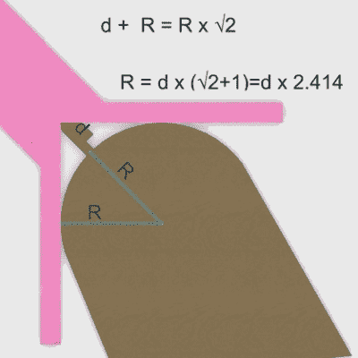

# 3D 打印半径规，只需添加卡尺(和一点数学)

> 原文：<https://hackaday.com/2018/09/09/3d-printed-radius-gauge-just-add-calipers-and-a-wee-bit-of-math/>

With 3D printed arms of fixed measurements, the depth reading from a set of digital calipers can be used to calculate the radius of a curve.

专注于一项特定工作的专用工具往往会被提炼出它们的本质，并变成一种经济型消费产品。这方面的一个例子是半径(或圆角)量规:一组不同大小的曲线，用于通过反复试验来测量曲面的半径。对一些人来说，这样的产品代表着问题的解决。其他人看到了一个全新视角的机会，就像这个由[Arne Bergkvist]设计的[卡尺 3D 打印半径规](https://www.thingiverse.com/thing:2746027)。

[Arne]的 3D 打印半径规是一个简单的对象；几乎无处不在的数字卡尺模型的刚性附件。通过将待测曲线放在设备的两臂之间，并使用卡尺的深度测量来测量到曲线表面的距离，简单计算`radius = distance * 2.414`即可显示曲线的半径。然而，这种简化的计算做出了许多假设，并且仅适用于[Arne]的特定设计。

弗雷德里克·韦兰德(Fredrik Welander)的另一个版本代表了对同一概念的更灵活的理解。他的 [RadGauge](https://www.thingiverse.com/thing:2811444) 设计(上图)有几个不同的尺寸，以适应各种各样的对象，[他的 Git 库](https://subsite.github.io/rad/)提供了一个计算器工具以及一些微调技巧，以允许打印附件的尺寸变化。

3D 打印打开了许多大门，像这样的项目表明，创造的塑料小玩意并不总是最终结果本身；有时，它们是使工具或部件以不同方式工作的粘合剂。为了帮助最大限度地利用 3D 打印，请查看[如何最好地利用 3D 打印零件](https://hackaday.com/2014/01/13/fastening-3d-printed-parts/)制作紧固件的深度报道，以及【郑健国】的[使用 3D 打印支架和铝挤压](https://hackaday.com/2018/05/08/how-to-build-anything-out-of-aluminum-extrusion-and-3d-printed-brackets/)制作任何东西的指南。