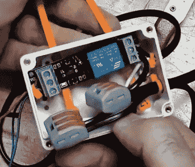

# 为 OctoPrint 添加 3D 打印机电源和灯光控制

> 原文：<https://hackaday.com/2018/09/15/adding-3d-printer-power-and-light-control-to-octoprint/>

OctoPrint 是监控打印机的一个很好的方式，尤其是在添加了网络摄像头的情况下。使用平板电脑或手机，你可以在家里的任何地方(或世界上，如果你采取适当的预防措施)，随时关注打印机正在做什么，让你不必像对待婴儿一样坐在打印机旁边。但是简单地观察你的打印机工作只是 OctoPrint 庞大插件社区提供的一小部分功能。

 正如【杰瑞米·S·库克】所展示的，为你的 OctoPrint 设置添加打印机和辅助照明的电源控制是相当容易的[。当通过网络摄像头监控时，能够打开打印床上方的灯显然是一个很大的帮助，并且能够在打印完成后关闭打印机可以让您安心。如果你特别勇敢，这也意味着你可以打开打印机的电源，完全远程开始打印，但如果第一层打印不完美，祝你好运。](https://www.instructables.com/id/OctoPrint-3D-Printer-Power-and-Lighting-Control/)

在硬件方面，你只需要一些 3.3V 的继电器，让运行 OctoPrint 的 Raspberry Pi 触发，以及一个放线的外壳。[Jeremy]在这个设置中只使用一个继电器来同时给打印机和灯供电，但是通过对软件的一些调整，如果你想要的话，你可以获得独立的控制。

在软件方面，[Jeremy]正在使用一个名为“PSU 控制”的[OctoPrint 插件，它实际上是用来从 Pi 的 GPIO 引脚控制 ATX PSU 的，但其原理足够接近于抛出一个继电器。如果你想做一个完全远程控制的机箱，其他插件允许控制更广泛的设备和 GPIO 引脚。另外，如果你找不到任何能完全满足你的切换需求的东西，你也可以创建你自己的 OctoPrint 插件。](https://github.com/kantlivelong/OctoPrint-PSUControl)

[【Jeremy】之前记录了他独特的坐骑](http://hackaday.com/2018/08/16/hanging-sliding-raspi-camera-adds-dimension-to-octoprint/)让他的树莓派和相机对准他的打印机，如果你想[用 Octolapse](http://hackaday.com/2018/07/02/coolest-way-to-watch-3d-printing-lights-camera-octolapse/) 创作一些很酷的视频，这自然很重要。

 [https://www.youtube.com/embed/ThzdNwFc7mA?version=3&rel=1&showsearch=0&showinfo=1&iv_load_policy=1&fs=1&hl=en-US&autohide=2&wmode=transparent](https://www.youtube.com/embed/ThzdNwFc7mA?version=3&rel=1&showsearch=0&showinfo=1&iv_load_policy=1&fs=1&hl=en-US&autohide=2&wmode=transparent)

