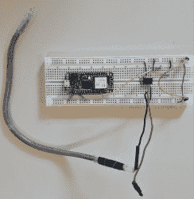

# 使用这种蛇形传感器有多种手势方式

> 原文：<https://hackaday.com/2018/09/22/there-are-multiple-ways-to-gesture-with-this-serpentine-sensor/>

[Serpentine 是一款手势传感器，相当于](https://hackaday.io/project/160713-serpentine)一款薄膜电位计、伸缩传感器等。它是自供电的，可以用于可穿戴的黑客，例如横幅图像中显示的项链，尽管我们更多地考虑了[黑客大会徽章](https://hackaday.com/2016/11/03/the-hacks-and-puzzles-of-the-hackaday-supercon-badge/)的挂绳，增加了一个更高层次的黑客能力。这是一个很好的方式来发送信号，没有其他人知道你在做什么，而且很容易做到。

蛇纹石是包括亚特兰大乔治亚理工学院的[fereshthe]在内的一组研究人员的研究项目的核心。该传感器是一个由硅橡胶和 PDMS(一种硅酮弹性体)芯制成的管子，周围缠绕着一个铜线圈，然后是更多的硅酮混合物，一卷镀银尼龙线，最后是一层硅酮混合物。完整的制作说明在他们的 Hackaday.io 页面上。

管状传感器有三种常见的交互方式:径向、纵向和切向。这三者的各种组合会产生令人惊讶的各种手势，如轻拍、按压、滑动、扭转、拉伸、弯曲和旋转。这些手势会在镀铜和镀银的尼龙电极上产生信号。这些信号通过一个放大器电路，该电路使用 WiFi 将它们发送到笔记本电脑上，在那里信号处理可以区分手势。它能以大约 90%的准确率识别不同的种类。下面的视频演示了测试之前的培训步骤。

蛇纹石的工作原理是[摩擦电纳米发电机(TENG)现象](http://nanoscience.gatech.edu/paper/2014/14_FD_01.pdf)的结果，这是摩擦电效应和静电感应的混合，但也可以制造出利用其他效应的织物。一个例子是[这种织物键盘和特雷门琴](https://hackaday.com/2017/06/17/fabrickeyboard-is-piano-theremin-and-more/)，它部分利用压电效应工作。

 [https://www.youtube.com/embed/pNcaQrJ2NA4?version=3&rel=1&showsearch=0&showinfo=1&iv_load_policy=1&fs=1&hl=en-US&autohide=2&wmode=transparent](https://www.youtube.com/embed/pNcaQrJ2NA4?version=3&rel=1&showsearch=0&showinfo=1&iv_load_policy=1&fs=1&hl=en-US&autohide=2&wmode=transparent)

The [HackadayPrize2018](https://hackaday.io/prize) is Sponsored by:     