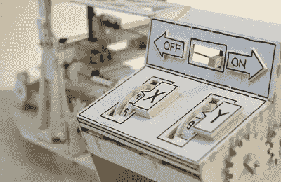

# 微型绘图仪是由细绳和纸板制成的

> 原文：<https://hackaday.com/2018/10/04/tiny-plotter-is-made-of-strings-and-cardboard/>

如果你已经在 Hackaday 逛了一段时间，你肯定已经看过[尼克拉斯·罗伊]的作品了。一个多产的制造商…所有的东西，我们已经报道他的项目超过十年了。他是精英黑客群体中的一员，可以说他们从 Hackaday 还在使用黑白图片的时候就已经存在了。然而，有时项目会失败。

 多亏了我们亲爱的读者之一发来的提示，我们现在才看到这个[不可思议的纸板绘图仪【尼克拉斯】几年前为他在奥芬巴赫艺术与设计大学](http://www.niklasroy.com/project/149/cardboard_plotter)开办的工作室制作的。这种全手动的机器由两个转盘和一个开关控制，它甚至配有一本书，允许你通过拨打特定的数字序列来“编程”。

这并不是说它有损于这个项目，但值得一提的是，使用的“纸板”[Niklas]是所谓的 Finnboard，一种由木浆制成的薄建筑材料，看起来类似于轻木板材。这种材料易于加工，而且比我们传统上认为的纸板要结实得多。除了鳍板，绘图仪使用焊条作为轴和滑轨，用胶水、胶带和绳子将它们固定在一起。

控制面板上的刻度盘对应于 X 轴和 Y 轴:转动 X 轴刻度盘向前和向后移动床，Y 轴刻度盘向左和向右移动笔。刻度盘上方的开关降低和升高笔，使其与下面的纸接触。通过这三个输入之间的协调，操作员可以“徒手”绘制或按照“代码簿”中列出的顺序重新创建存储的图形和信息。

信不信由你，这不是我们第一次看到有人用纸板做绘图仪。尽管之前进入这个特定领域的作品确实使用了伺服系统来移动。

 [https://www.youtube.com/embed/hfAFWzh2VEM?version=3&rel=1&showsearch=0&showinfo=1&iv_load_policy=1&fs=1&hl=en-US&autohide=2&wmode=transparent](https://www.youtube.com/embed/hfAFWzh2VEM?version=3&rel=1&showsearch=0&showinfo=1&iv_load_policy=1&fs=1&hl=en-US&autohide=2&wmode=transparent)

【感谢 Setvir 的提示。]