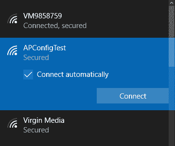

# ESP8266 上的简易接入点配置

> 原文：<https://hackaday.com/2018/10/04/easy-access-point-configuration-on-esp8266/>

在您的项目中使用 ESP8266 的最大优势之一是可以轻松启动和运行 WiFi。只需插入 WiFi 库，将 SSID 和加密密钥放入源代码中，就可以开始了。它可以在几秒钟内通过网络认证，然后您就可以继续构建您的项目了。但是如果你想把你的项目带到其他地方，或者把你的源代码分发给其他人，事情就有点棘手了。很快我们就知道了使用静态变量进行认证的缺点。

 虽然这个问题已经有了一些解决方案，但【马丁·兰斯福德】并不太喜欢这些方案。通常，他们将 ESP8266 置于接入点模式，允许用户连接，然后询问他们应该使用哪个网络进行身份验证。但是他不希望他的项目需要现有的网络，[，并且认为他可以做一个现场可配置的 AP](https://msraynsford.blogspot.com/2018/10/access-point-configuration.html) 。

使用它很简单。一旦 ESP8266 启动，它将以“APConfig XXXXXX”的形式创建一个新网络，这应该很容易从您的客户端设备找到。连接后，您可以转到一个简单的管理页面，该页面允许您配置新的 AP 名称和加密密钥。您甚至可以选择将“密码”字段留空来创建一个开放的 AP。重新启动后，ESP8266 将使用定义的参数创建一个新网络。

[Martin]还包含了一个“后门”,允许任何物理访问 ESP8266 板的人创建一个新的开放 AP，用于重新配置网络设置。在启动过程中，会有一个短暂的时间，以特定的 LED 闪烁来表示，在此期间，您可以点击重置按钮并触发 open AP。这可以让你在忘记自己给了什么键的情况下不会被锁在自己的项目之外。

如果你不是一个走简朴路线的人，看看[我们已经看到的一些更强大的解决方案](https://hackaday.com/2018/01/23/easier-end-user-setup-for-esp32-projects/)为[更容易的最终用户设置 ESP8266](https://hackaday.com/2017/03/18/configure-esp8266-wifi-with-wifimanager/) 。