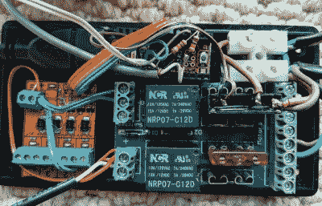

# 放大器控制的电动显示器

> 原文：<https://hackaday.com/2018/10/06/amplifier-controlled-motorized-display/>

人们很容易对 Chromecast 或 Sonos 等设备感到厌倦，这些设备让用户可以通过移动设备或电脑远程控制 AV 设备。你可以从你的手机里选择一些东西来播放，然后通过 Wi-Fi 的魔力把它发送到你的扬声器上。但至少偶尔有一个音乐可视化的展示还是不错的。

 为了满足这种偶尔想要在你的媒体设置上有一个显示器的愿望，你可以跟随【史蒂文·埃利奥特】和[的脚步，创建一个只在需要时弹出的 DIY 电动显示器](https://diyodemag.com/features/motorised_second_screen)。看到电视从柜子里升起来的视频和其他类似的欺骗，他决定用他放在身边的旧电脑显示器创作自己的版本。

监视器由一个结实的线性致动器抬起，该致动器被放置在一个方形金属栅栏柱内，以防止旋转。它已经有一个电源和控制板，上面有用于伸缩的继电器，所以[Steven]只需要找到一种方便的方式来启动它们。

答案来自一个有点非传统的来源:他的放大器。[Steven]解释说，许多放大器具有“触发输出”功能，它使用标准的立体声 3.5 毫米连接器，向连接的设备发送 12V 脉冲。这通常用于在放大器切换到相应输入时开启下游器件。它太短了，也没有足够的力量来关闭执行器继电器，但它很容易检测到。

[Steven]使用一个 LeoStick 微控制器来等待来自放大器的脉冲，然后根据所选的输入来提高或降低显示。还有一个 SPST 瞬时开关，可用于手动触发执行器。除了线性致动器有点吵之外，他说这种设置非常好，如果他只是想快速浏览一下正在播放的内容或对他的 DVR 进行编程，就不必启动投影仪。

[我们再也看不到像这样的电动展示升降机了](https://hackaday.com/2009/05/02/iphone-controlled-tv-lift/)，自从壁挂式液晶显示器流行起来后就没有了。但这仍然是一个很酷的效果，今天由于电视和显示器不再像一辆小型汽车那么重，这变得更容易了。

【感谢 Baldpower 的提示。]