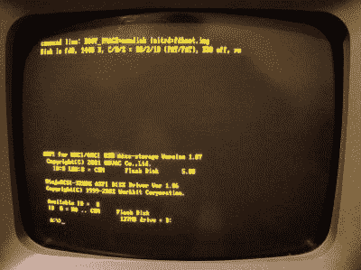

# 从老式 MFM 硬盘中恢复数据

> 原文：<https://hackaday.com/2018/10/10/recovering-data-from-a-vintage-mfm-drive/>

即使你不是一个老式电脑爱好者，你可能也知道老式电脑的硬盘容量很大，不能容纳太多数据。想象一下一个几磅重的硬盘，容量只有当今最便宜的 USB 闪存驱动器的 1/1000。但你可能*没有*意识到的是，如果你追溯到足够长的时间，驱动器不仅容量较低，它们还利用了根本不同的技术，并依赖于今天只不过是历史脚注的协议。

 一个很好的例子是大约 1984 年改进的调频(MFM)驱动器[michas omkowski]负责从中恢复一些文件。你不能把这个怪物放进一个 USB 盒子里；从它那里复制文件需要一次有趣的计算机记忆之旅，伴随着一些现代技术，这些技术肯定会让仍然喜欢不时涉足 MS-DOS 领域的黑客们感到高兴。

MiniScribe 2012 驱动器有自己的 WD1002A-WX1 8 位 ISA 控制器卡。[micha]是那种碰巧有 ISA 兼容 AT 主板的人，但他没有合适的奔腾处理器冷却器。他用橡皮筋把一个随机的散热片粘在上面，并把时钟速度设置得尽可能低，这足以让他完成复印过程。

不想摆弄软盘，[micha]然后组装了一个设置，让他在 Arch Linux 下 PXE 启动 MS-DOS 6.22。他使用了 PXELINUX，syslinux 包的一部分，并在配置文件中的`pxelinux.cfg`目录下创建了一个 DOS 条目。然后他安装了 [netboot](http://brokestream.com/netboot.html) ，它将 DHCP 和 TFTP 服务器结合成一个简单的包，并为 AT 机器的 3com 3C905C-TXM 网卡配置了 MAC 地址。

随着硬件和操作系统的建立和运行，只需要将文件从 MFM 硬盘中取出，放到一些更现代的东西上。他试图将它们复制到第二个 IDE 驱动器上，但似乎存在某种冲突，因为两个驱动器不能同时运行。所以他从他的锦囊妙计中拿出另一个解决方案:[在 MS-DOS 上使用 USB 大容量存储设备](https://slomkowski.eu/retrocomputing/usb-mass-storage-on-ms-dos/)。通过模拟 SCSI 驱动器，他能够让插入 PCI USB 卡的标准闪存驱动器工作，最终将这些大约 35 年的旧文件拖到了 21 世纪。

我们喜欢在 hack aday 上让旧硬件保持活力，记录的方法不仅可以 PXE 启动 DOS，还可以在启动和运行时使用 USB 存储设备，这将有望激励更多的黑客来[清除阁楼上旧 386](https://hackaday.com/2014/09/01/hackaday-retro-edition-386-compaqs/)的灰尘。