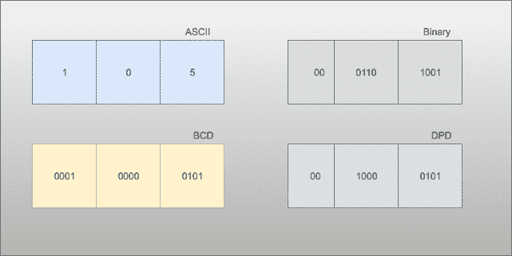

# 轻松打包十进制数

> 原文：<https://hackaday.com/2018/11/30/packing-decimal-numbers-easily/>

虽然台式电脑拥有大量的计算能力和存储空间，但一些小型 CPU 没有太多的空间来存储东西。更重要的是有些 CPU 做乘除运算不太好。FPGAs 也是如此。假设我们要从一个串行端口获取一串三位数的十进制数。我们希望存储尽可能多的数据，我们不想做太多的数学运算，因为我们做不到，它很慢，或者它可能会让我们的处理器保持更长时间的清醒，我们希望睡眠以节省电能。我们希望找到一种方法，尽可能地将数字压缩到接近理论上的最大值，但只需很少或不需要数学运算。

简单的方法是将数字存储为 ASCII。非常适合处理，因为它们可能已经是 ASCII 格式了。如果不是，你只需在每个数字上加 30 个十六进制，就大功告成了。这对于存储空间来说很糟糕，因为如果是二进制的，我们可以用 10 位存储 999，而现在我们用的是 24 位！顺便说一下，如果你遵守我们的规则，用二进制存储并不是一个好的选择。你需要乘以 10 和 100(或者 10 乘以两次)才能得到编码。当然，你可以把它变成两个移位和一个加法(8x+2x=10x)，但是没有简单的方法去做解码所必须做的除法。

当然，我们没有理由不能只存储十进制数字。这叫二进制编码十进制或 BCD，也有一些优点。对 BCD 数进行数学运算非常容易，而且不会出现舍入问题。一些 CPU 甚至有 BCD 操作的特定指令。然而，三位数需要 12 位。我们同意，这比 24 岁好。但是没有理论上最大值好。毕竟，如果你想一想，你可以在 4 位中存储 16 个不同的代码，而我们只存储 10 个，因此丢失了 6 个位置。乘以 3，你就浪费了 18 个代码。

但是有一种方法可以不做任何数学计算就达到 10 位的目标。它被称为 DPD 或密集十进制。你可以把三个十进制数字转换成十位，然后再转换回来，根本不需要真正的数学运算。您可以用一个小的查找表来实现它，或者只做一些非常简单的多路复用器式逻辑，这意味着它便宜且易于在软件或 FPGA 上实现。

比特的这种压缩是多尔·赫兹和蒂恩·陈驰在 1969-1971 年间都注意到的问题。赫兹为罗克韦尔工作，陈为 IBM 工作，并向另一位 IBM 员工欧文·泽浩咨询。赫兹和陈独立开发了后来被称为 Chen-Ho 编码的东西。不久之后，Michael Cowlinshaw 发表了一种称为 DPD 或密集压缩十进制的改进编码，成为 IEEE 浮点标准的一部分。

[](https://hackaday.com/wp-content/uploads/2018/10/dpd.png)

赫兹和陈使用的编码略有不同，但考林肖方案有几个优点。你可以轻松有效地增长到 3 位数以上。从 0 到 79 的十进制数映射到自身。每个数字的第 0 位被保留下来，这样你就可以在不拆包的情况下检查偶数和奇数。

## 它是如何工作的？

想想用二进制写的三个 BCD 数字。因为每一位都在[0-9]的范围内，所以可以用四位来表示，所以我们的三位看起来就像`Xabc Ydef Zghi`。例如，如果第一个数字是 9，那么`Xabc` = 1001。因为我们只对 9 以内的数字进行编码，如果`X`是 1，那么`a`和`b`肯定是 0，这样就给我们留下了一些空间来存放其他的位。现在把`XYZ`看成自己的三位二进制数。这导致了八种不同的情况。下表显示了所有八种情况的编码，小写 x 表示无关紧要:

| **案件(XYZ)** | **Xabc** | **性能** | **Zghi** | **编码**
**9 8 7 6 5 4 3 2 1 0** |
| 000 | 0abc | 0def | 0ghi | a b c d e f g h I |
| 001 | 0abc | 0def | 100i | a b c d e f 1 0 0 i |
| 010 | 0abc | 100 华氏度 | 0ghi | a b c g h f 1 0 1 i |
| 011 | 0abc | 100 华氏度 | 100i | a b c 1 0 f 1 1 1 i |
| One hundred | 100c | 0def | 0ghi | 高 c d e f 1 1 0 i |
| One hundred and one | 100c | 0def | 100i | d e c 0 1 f 1 1 1 i |
| One hundred and ten | 100c | 100 华氏度 | 0ghi | g h c 0 0 f 1 1 1 i |
| One hundred and eleven | 100c | 100 华氏度 | 100i | x x c 1 1 f 1 1 1 i |

请注意，`c`、`f`和`i`总是通过。其他位的位置因情况而异，但您不需要任何数学知识就可以简单地重新排列这些位，并在 10 位编码的位 6-5 和位 3-1 中添加固定的指示位。

在示例图中，105 匹配大小写 000 —所有前导位都是零—因此编码是 0010000101 或 085 十六进制。如果数字是 905，那么它将匹配大小写 100，并编码为 1010001101 或 28D 十六进制数。解码只不过是向后运行表的问题。如果第 3 位是零，这就是 000 的情况。否则，查看第 2 位和第 1 位。除非它们是 11，否则可以直接在表中找到对应的行。如果它们是 11，你必须进一步查看第 6 位和第 5 位来找到正确的条目。然后你只需根据表格展开这些位。

## 履行

我对 FPGA 设计最感兴趣，所以我写了一些简单的 Verilog 来完成这项工作，你可以[在网上](https://www.edaplayground.com/x/33LH)试试。包含的测试平台运行所有 1，000 个可能的数字，并输出十六进制的 DPD 码、3 个输入数字、一个斜线和 3 个输出数字，如下所示:

```
0fd = 9 7 1 / 9 7 1
1fc = 9 7 2 / 9 7 2
1fd = 9 7 3 / 9 7 3
2fc = 9 7 4 / 9 7 4
2fd = 9 7 5 / 9 7 5
3fc = 9 7 6 / 9 7 6
```

编码非常简单。下面是表格中两行的代码片段:

```

3'b000:
dpd={digit2[2:0],digit1[2:0],1'b0,digit0[2:0]};
3'b001:
dpd={digit2[2:0],digit1[2:0],3'b100,digit0[0]};

```

您会注意到代码没有使用时钟——它是纯逻辑的，大量使用了`case`和`casez`语句。这些就像 C 语言中的`switch`语句，尽管`casez`语句可以使用？作为搭配的时候不要在意。

我把 Verilog 和 C 实现都留在了 GitHub 的 T1 上。两个人都很天真。例如，Verilog 代码没有利用一些位“通过”的事实然而，一个好的编译器或合成器可能会产生一些非常好的代码。但是，如果您真的担心最小化布局或代码空间或最小化功耗，您需要调整这些以适应您的架构和需求。

## 算法

过去，当你学习计算机时，首先要学的是算法和数据结构。我不确定是不是这样了。但是这个世界充满了晦涩难懂的算法，如果我们知道它们，我们可能会使用它们。我很惊讶没有更多像[肖恩·安德森]著名的[bit twiddling hacks](https://graphics.stanford.edu/~seander/bithacks.html)page 这样的算法目录。可能对所有事情来说最好的——这意味着它势不可挡——是 [NIST 爸爸词典](https://xlinux.nist.gov/dads/)。被警告！你可以花很多时间浏览这个网站。尽管这个网站很大，但他们明确排除了商业、通信、操作系统、人工智能和许多其他类型的算法。

我的意思是，当然，我们大多数人都知道气泡排序和壳排序，但你知道鸡尾酒排序或如何做理查森-露西反卷积吗？爸爸们也不知道，尽管维基百科很有帮助。我们在这两个地方都找不到[一致的开销字节填充](https://www.wikiwand.com/en/Consistent_Overhead_Byte_Stuffing)或 Chen-Ho。看起来这将是一个伟大的人工智能项目，可以为特定用途分类并帮助定位算法和数据结构。但是现在，你至少可以在你的已知技巧包中添加密集打包的十进制数。