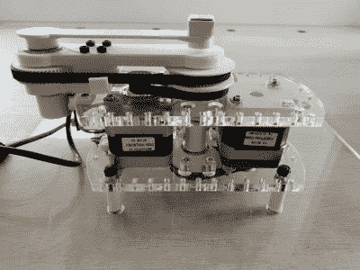

# SandBot 快乐而不知疲倦地在沙子里滚动图案

> 原文：<https://hackaday.com/2018/10/18/sandbot-happily-and-tirelessly-rolls-patterns-in-sand/>

在沙子上绘制几何图案所涉及的耐心和精确度正是机器人的拿手好戏，展示这一点的是[【罗布·多布森】的*沙机器人*](https://robdobson.com/2018/08/a-new-sandbot/) ，这是一个借助带有磁耦合球的手臂来绘制图案的机器人。

SandBot, SCARA version. The device sits underneath a sand bed, and a magnet (seen at the very top at the end of the folded “arm”) moves a ball bearing through sand.

SandBot 不是笛卡尔 XY 设计。XY 框架至少需要和沙盘本身一样大，但是 SCARA 臂可以更紧凑。Sandbot 还大量使用 3D 打印和激光切割丙烯酸片，不需要外部框架。

[rob]文章充满了精彩的细节和插图，非常值得一读。他之前的 SandBot 设计也值得一试，因为它包含了各种实用的细节，比如什么尺寸的滚珠轴承最适合在细沙中使用(事实证明，直径在 15 到 20 毫米之间。太小，球在沙粒上运动不平稳，太大，运动明显滞后。)SCARA 沙机器人[的设计文件在 GitHub](https://github.com/robdobsn/SandTableDesignScara) 上，但是【罗伯】在他的[文章](https://robdobson.com/2018/08/a-new-sandbot/)中有方便的链接，便于参考。

沙子和机器人(或任何移动部件)并不是一个完全自然的组合，但这并没有阻止任何人。我们已经看到 [Clearwalker](https://hackaday.com/2017/06/01/watch-the-clearwalker-light-up-and-dip-its-toes/) 在沙滩上大步行走，[沙画机器人](https://hackaday.com/2018/07/03/drawing-lines-in-the-sand-taking-beach-graffiti-to-the-next-level/)一边滚动一边放下附肢在沙子上刻下信息。