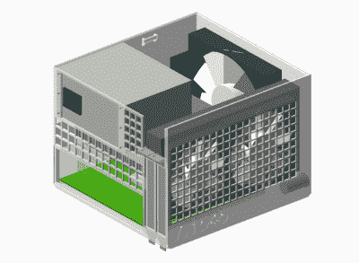

# 一个开放式迷你 ITX 电脑机箱

> 原文：<https://hackaday.com/2018/11/05/an-openscad-mini-itx-computer-case/>

在 Hackaday，我们对 3D 打印外壳并不陌生。从大量印刷的树莓皮盒子到电子项目的定制外壳，小塑料盒是桌面 3D 打印的绝佳应用。但是随着打印机变得越来越大，灯丝变得越来越便宜，那些小盒子不需要总是那么小。我们也不是在谈论为你的运动鞋系列装盒子，如果你有时间和印刷量，你可以为你的电脑做一个外壳。

【Nirav Patel】撰文分享了他令人印象深刻的 [3D 打印迷你 ITX 电脑机箱项目](https://eclecti.cc/hardware/fully-parametric-3d-printable-computer-case)，这本身就是一个足够简洁的技巧，但他将这一概念向前推进了一步，在 OpenSCAD 中将它变成了一个参数化设计。这允许用户输入他们特定的硬件配置，并接收定制案例的 STL 文件。受支持的硬件列表还不是很长，但是随着 GitHub 上的 OpenSCAD 代码并在 BSD 许可下发布，希望社区可以随着时间的推移而改进。

为了保持简单(和强大)，[Nirav]实现了他所谓的“桶”设计。大多数情况下是一个单一的打印，这需要很长时间(在他的 Prusa i3 MK3 上不到 40 小时)，但几乎消除了任何印刷后的组装。只有可选支脚和盖子需要单独印刷。螺纹插件在整个设计中用于安装硬件，因此在硬件更换或升级期间，您不会有吹出印刷孔的风险。

一个特别简洁的功能，也是 OpenSCAD 强大功能的证明，是表壳的内部体积经过计算，并压印在设计的侧面。这有什么实际目的吗？不完全是，但[Nirav]认为这将吸引迷你 ITX 案例修改社区，他们显然是以升量来衡量他们的成就。

在之前，我们已经[见过一个 3D 打印的电脑外壳，但它使用丙烯酸板，没有大幅面打印机就无法制作。对于一个可以在黑客社区最喜欢的打印机](https://hackaday.com/2016/01/03/3d-printed-computer-case-brings-sexy-back/)上完成的项目，有一些东西要说。