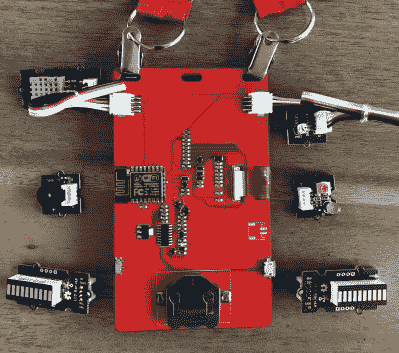

# 企业名片:甲骨文的代码卡

> 原文：<https://hackaday.com/2018/10/31/corporate-badgelife-oracles-code-card/>

我们倾向于认为精致的电子会议徽章是仅限于黑客场景的东西，但看起来 badgelife 运动正开始大受欢迎。现在，即使是“大男孩”也开始行动了，很快你就不能去一个沉闷的专业会议而不看到一片 RGB 发光二极管的海洋。我们将让 Hackaday 的好读者来决定这是否意味着它正式后酷。

 【诺尔葡萄牙】[来信告诉我们，他在甲骨文开创性团队任职期间，是如何创造出“代码卡”](http://theappslab.com/2018/10/29/making-an-iot-badge-badgelife-going-corporate/)的。该代码卡配有一个 ESP8266 和一个电子墨水屏幕，不仅可以作为一种时髦的身份识别方式，还可以作为物理设备从甲骨文的云中提取内容的真实演示。得让那些公司老板高兴。

目前，就徽章而言，代码卡是一种相当简单的硬件，但当时的目标是永远不要华而不实。不过，它的背面有两个四针 Grove 系统连接器，所以你可以插入额外的传感器和小工具，用于常规的徽章黑客会议。

为了最大化可充电硬币电池的运行时间，只有在用户按下前面的一个按钮后，代码卡才会打开 ESP。一旦 ESP 完成了用户要求的任何任务，它的电源将完全关闭，而不是进入待机状态。结合电子墨水屏幕，当设备不主动更新显示或下载新内容时，功耗可以忽略不计。

[Noel]在软件方面真的全力以赴，甚至开发了一个 web 应用程序，让与会者从他们的智能手机上配置他们的代码卡。短按和长按徽章的两个按钮可以分配不同的功能，用户甚至可以从固件中包含的图像列表中选择各种功能的图标。与会者可以上传自己的图像的功能没有被淘汰，但这肯定不会阻止人们黑进已公布的 Arduino 源代码，并找出如何手动完成它。

如果你觉得代码卡看起来有点熟悉，那可能是因为它是与 Badgy 的创造者 [Squarofumi 共同设计的。因此，即使你没有参加甲骨文即将举行的任何会议，如果你想玩一个电子墨水徽章，你也不是完全没有运气。](http://hackaday.com/2018/08/08/programmable-badge-uses-e-ink-and-esp8266/)