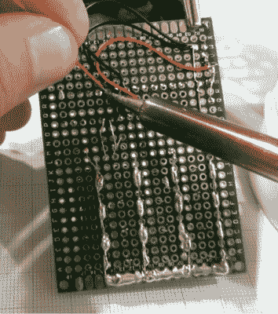

# 袖珍 Arduino 计算器是一个伟大的第一个项目

> 原文：<https://hackaday.com/2018/11/06/pocket-sized-arduino-calculator-makes-a-great-first-project/>

我们都有计算器，在我们的手机上，在我们的网络浏览器上，甚至在家里的“助手”里，它整天都在偷听你的谈话，你脱口而出的一个数学问题可能会帮你解决。我们当中最铁杆的人甚至可能仍然有一个真正的计算器。因此，在这种情况下，构建自己的 DIY 计算器可能看起来不太令人兴奋。但是我们不能否认[【丹科·贝尔托维奇】的这个 Arduino 计算器项目坐在板凳上看起来会很不错](https://www.youtube.com/watch?v=U2JI582V5xk)。

 在休息后的视频中，【Danko】带我们浏览了计算器的创建过程，从放置所有通孔组件到编写将所有组件组合在一起的代码。特别注意解释布线，使这是一个很好的项目，为那些刚刚开始他们的数字黑客之旅。这也有助于整个事情是放在一起的 perfboard 跳线；这个不需要 PCB 制造。

对于用户界面，[Danko]使用 17 个触摸开关阵列作为键盘和非常清晰的 128×32 I2C 有机发光二极管显示器。除了电池、晶体和一些无源元件之外，这就是将这个项目组合在一起所需的所有支持硬件。你甚至不需要外壳:第二块 perfboard 和一些支架用于将电池和脆弱的电线夹在中间。

当然，展览的明星是 ATmega328P 微控制器，它安装在有机发光二极管屏幕正下方的一个荣誉位置。芯片在 Arduino Uno 中被编程，然后被移植到计算器中，如果你身边没有专门的程序员，这是一个巧妙的技巧。鉴于在网上可以买到如此便宜的 Arduino 克隆产品，[这正成为一种更普遍的做法](https://hackaday.com/2018/07/09/build-your-own-portable-arduino-soldering-iron/)。

这个计算器的结构让我们想起了我们在夏天看到的 DIY 辛克莱科学计算器。但是如果你想看到自制计算器技术的巅峰，这个[树莓 Pi 驱动的版本是很难超越的](https://hackaday.com/2018/08/07/diy-scientific-calculator-powered-by-pi-zero/)。

 [https://www.youtube.com/embed/U2JI582V5xk?version=3&rel=1&showsearch=0&showinfo=1&iv_load_policy=1&fs=1&hl=en-US&autohide=2&wmode=transparent](https://www.youtube.com/embed/U2JI582V5xk?version=3&rel=1&showsearch=0&showinfo=1&iv_load_policy=1&fs=1&hl=en-US&autohide=2&wmode=transparent)

