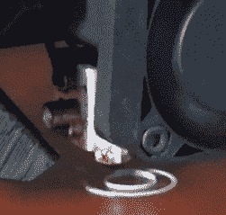

# 带有黑客代码的 3D 打印弹簧

> 原文：<https://hackaday.com/2018/11/14/3d-print-springs-with-hacked-gcode/>

如果你过去使用过桌面 3D 打印机，你几乎肯定已经和“字符串”战斗过了。这些细丝在空气中变硬，通常是因为打印机的喷嘴在户外的两点之间快速移动。根据严重程度和打印材料的不同，这些多纤维的闯入者可能会成为难看的烦恼，也可能引发令人心碎的打印失败。但是大多数人看到的是推着熔化的塑料到处走的恼人现实，Makefast Workshop 的 Adam Kumpf 看到了灵感。

 注意到他们打印机的喷嘴留下了细绳，【亚当】想知道是否有可能按需诱导这些半空中的打印工件。更好的是，有没有可能[驯服它们生产出一件有用的物品](http://makefastworkshop.com/hacks/?p=20181112)？事实证明确实如此，现在我们有了基于网络的工具来证明这一点。

正如[Adam]解释的那样，你不能只是在普通切片机中加载一个弹簧的 3D 模型，然后期望你的打印机生产出一个有用的对象。该软件将，正如它被设计的那样，识别没有大量支持材料的对象不能被打印。现在，理论上您可以继续打印这样一个 spring，但是祝您好运获得支持材料。

诀窍是完全抛弃传统的切片器，因为逐层的方法在这里根本行不通。通过使用精心调整的参数手动创建 GCode，[Adam]发现可以让打印机以零件冷却风扇会立即固化塑料的精确速度挤出塑料。接下来的问题就是把这个概念应用到一个缓慢的螺旋运动中。最终结果是功能性的，尽管不是很强的螺旋压缩弹簧。

但你不必相信他们的话。这项研究导致了一个在线工具的创建，该工具允许您插入所需弹簧的变量(螺距、半径、转数等)，以及关于打印机的详细信息，如喷嘴直径和温度。结果是一个定制的 GCode，当加载到您的打印机上时，它(有希望)会产生所需的 spring。我们很想知道是否有读者能够在他们自己的打印机上复制这种效果，但我们应该提到，直接摆弄打印机的 GCode 并非没有风险:从跳过步骤到剥离灯丝到磁头崩溃。

这些结果让我们想起了几年前我们展示的 3D 点阵打印机，但即使是那台机器也没有使用标准的 FDM 技术。看看这种特殊的技术还能有什么其他的应用将会很有趣。

 [https://www.youtube.com/embed/kWE8AzJY8qc?version=3&rel=1&showsearch=0&showinfo=1&iv_load_policy=1&fs=1&hl=en-US&autohide=2&wmode=transparent](https://www.youtube.com/embed/kWE8AzJY8qc?version=3&rel=1&showsearch=0&showinfo=1&iv_load_policy=1&fs=1&hl=en-US&autohide=2&wmode=transparent)

