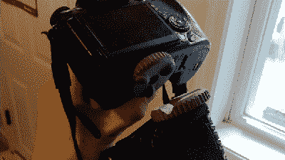

# 3D 打印的运动相机底座

> 原文：<https://hackaday.com/2018/11/19/a-3d-printed-kinematic-camera-mount/>

[Enginoor]正在寻找。他想进入 3D 打印的世界，但不满足于制造小玩具和小饰品。如果他要打印一些东西，他希望它是实用的，理想的是用更传统的方法无法快速轻松地制作出来的东西。因此，他带着一个相当强大的展示亮相:[一个磁性麦克斯韦运动耦合摄像机支架](https://www.enginoor.com/magnetic-camera-mount/)。

 如果你只认可*中某些*的那些术语，也不要觉得不好。以其创造者[詹姆斯·克拉克·麦克斯韦](https://en.wikipedia.org/wiki/James_Clerk_Maxwell)的名字命名，他在 1871 年提出了这一设计，麦克斯韦运动联轴器是一种自定向连接，适用于需要可靠连接的应用，同时还能快速、方便地拆卸。当然，对我们来说，这听起来是一个将相机固定在三脚架上的好方法。

但是由三个凹槽和匹配的半球组成的麦克斯韦设计只是等式的一半。它允许[enginoor]精确地、可重复地将摄像机对准，但它本身没有任何保持力。这就是磁铁发挥作用的地方。通过在两个部分设计口袋，他能够在配合面上安装强磁铁。这给了安装时一个令人满意的“快照”,他信任它足以容纳他的佳能 EOS 70D 和镜头。

[enginoor]说他可以把磁铁的孔做得更紧一点(从而跳过他目前使用的胶水)，但除此之外，他的第一个 3D 打印设计取得了圆满成功。他把这张照片送到 Shapeways 去印刷，但将来如果他能不断提出值得投入塑料的想法，他会考虑自己掌权。

当然[我们过去已经见过很多磁性相机支架](https://hackaday.com/2017/06/09/giving-a-camera-mount-a-little-magnetic-attractiveness/)，但我们真的很喜欢这种设计的自动校准方面。如果没有 3D 打印，它看起来绝对符合[难以制造的东西的标准。](https://hackaday.com/2018/05/15/hawkeye-the-3d-printed-tourbillon-movement/)