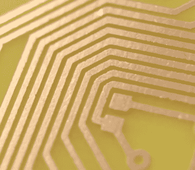

# 将 DLP 打印机用于制造 PCB

> 原文：<https://hackaday.com/2018/11/24/put-that-dlp-printer-to-use-making-pcbs/>

现在这些 DLP 打印机更便宜，更容易买到，我们开始看到黑客们在信封的边缘戳来戳去，看看这些机器还能做什么。[electronio OBS]最近得到了几台这样的打印机，他想用它们做一些印刷电路板生产的实验。

 这些打印机不是挤压熔化的塑料，而是利用光来一层一层地固化树脂。理论上，如果打印机足够好，能够固化光敏树脂进行高分辨率打印，它应该能够对光敏印刷电路板做同样的事情。

不幸的是，从 PCB 设计程序中获取 STL 需要几个中间步骤。在休息后的视频中，[electronio OBS]展示了他的工作流程，从 EasyADA 获得他的设计，并将其转化为 DLP 打印机可以理解的三维对象。他用 Blender 做到了这一点，看起来非常简单，但在过去，我们已经看到有人用 Inkscape 做了类似的技巧，如果那更符合你的风格的话。

一旦你把另一个维度嫁接到你的 PCB 设计上，你可能需要把它缩放到合适的尺寸。[Electronoobs]指出，他为 60 mm 宽的 PCB 制作的 STL 从 Blender 中出来时不到 2 mm 宽，所以你可能需要打破可怕的数学计算来找到合适的比例值。一旦尺寸看起来不错，你就可以像正常打印一样将这个文件加载到打印机中。

在打印机方面，[Electronoobs]用熨斗手动将 UV 光刻胶膜层压到一些覆铜板上，但你可以跳过这一步，也可以购买预感光板。在任何情况下，你把纸板放在 UV 树脂通常会去的地方，按下印刷按钮，等待大约十分钟。这应该给它足够的时间来暴露电路板，然后你继续进行黑客自古以来一直在做的正常清洗和酸浴过程。

正如[Electronoobs]所显示的，结果相当令人印象深刻。虽然这仍然不会使你在家庭实验室制作双面 PCB 更容易，但它看起来是一种非常令人信服的方法，甚至可以相对容易地生产 SMD 板。这已经不是第一次有人尝试使用 DLP 打印机打印一些 PCB 了，但是现在这项技术已经成熟了一些，看起来它终于变得实用了。

 [https://www.youtube.com/embed/-Qeq7ZgUOuE?version=3&rel=1&showsearch=0&showinfo=1&iv_load_policy=1&fs=1&hl=en-US&autohide=2&wmode=transparent](https://www.youtube.com/embed/-Qeq7ZgUOuE?version=3&rel=1&showsearch=0&showinfo=1&iv_load_policy=1&fs=1&hl=en-US&autohide=2&wmode=transparent)

