# 无线游戏控制器的发展

> 原文：<https://hackaday.com/2018/12/10/the-evolution-of-wireless-game-controllers/>

故事是这样的，雅达利正在为 1981 财年开发一款他们广受欢迎的家用视频游戏机，雅达利 2600。内部称为 Stella RC，这个模型修订版承诺触摸感应游戏选择开关，LED 指示灯，和控制器的板载存储。然而，这个项目的焦点是 Stella RC 中的“RC ”,它代表远程控制。雅达利的工程师们希望将玩家从束缚他们看电视的电线束缚中解放出来。

原型的问题是控制器中的射频发射器足够强大，可以发送超过 1000 英尺的信号。半径，他们干扰了市场上许多遥控车库开门器。更不用说，如果有另一个 Stella RC 控制台在公寓楼的同一频道上，或者只是在街对面，你可能会玩别人的陷阱运行。制造一种联邦通信委员会批准的产品所面临的挑战越来越大。所以雅达利决定放弃开创性的 Stella RC 项目。如果第一个无线游戏控制器是由任何其他公司制造的，那么它的实物证据就已经被消除了… [但是原型以一些特殊的方式神秘地离开了办公室](https://www.youtube.com/watch?v=0HPr5h-BUg0)。

> “雅达利当时已经放弃了这个项目……(雅达利的一名工程师)认为给他女朋友的儿子一个视频游戏系统玩会是一个很好的主意……我不能[评论]这段关系本身或 1981 年后发生的事情，但这就是这个系统如何离开雅达利的……以及为什么它今天仍然存在。”
> 
> *–**乔·科迪，Atari2600.com***

雅达利最终还是发布了一些无线 RF 2600 游戏杆，FCC 将会批准。在放弃 Stella RC 项目几年后，他们[以 69.95 美元的建议零售价(根据通货膨胀调整后约为 180 美元)发布了 Atari 2600 遥控操纵杆](http://www.ataricompendium.com/game_library/controllers/controllers.html)。巨大的价格标签与 1983 年视频游戏市场“跌落悬崖”交织在一起，很少有人知道无线视频游戏动作的幸福。很明显，射频游戏控制器只是走在了时代的前面，但必须有更便宜的替代品出现。

## 看不见，不受 IR 方案的控制

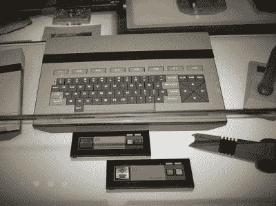

Nintendo AVS console deck and IR controller on display.

1985 年，电子游戏在美国是一个肮脏的词汇。当游戏本身仍在微机平台上运行时，家用游戏机业务实际上已经不存在了。在日本，任天堂通过在 Famicom 游戏机上销售视频游戏赚了很多钱。他们试图通过推出 Famicom 的修订版来复制在北美的成功，但它必须给将参加消费电子展(CES)的技术记者留下深刻印象。

原型系统被称为[任天堂高级视频系统](https://kotaku.com/5938751/your-nes-could-have-had-a-keyboard-and-wireless-controllers) (AVS)。它将配备一个键盘，一个盒式磁带驱动器，最重要的是两个无线控制器。控制器使用红外(IR)通信，接收器内置于控制台本身。每个控制器都有一个方形金属方向垫和四个动作按钮，给人以拉丝铝的印象。视频游戏控制器技术的进步好得令人难以置信，因为整个系统在那个圣诞节作为任天堂娱乐系统(NES)发布之前接受了改造。NES 缺少键盘、磁带机和红外控制器，其材料的变化几乎没有捕捉到 AVS 的高端闪存。红外的去除意味着该设备的制造成本更低。这一决定最终帮助 NES 取得了突破性的成功，反过来又带回了专门的视频游戏控制台。

第三方制造商也能够利用任天堂的成功推出任天堂不会推出的无线控制器。第三方无线控制器产品中最主要的是 Acclaim 遥控器。这款遥控器于 1989 年发布，配备了一个可调节的涡轮开关，可以在 30 英尺的范围内播放。远离红外线。只要没有人站在听筒前面，这几乎是真的。当任天堂发布[NES 卫星](https://en.wikipedia.org/wiki/NES_Satellite)适配器时，他们会重新考虑红外控制器的想法。它更像是一个无线控制器集线器，而不是控制器本身，但最多可以插入四个控制器，以便在支持的游戏中同时进行游戏。只要定期给它提供六节 C 型电池，它就能很好地工作，但视线要求是有限制的。可悲的是，红外线继续成为未来十年无线控制器技术的延伸(包括为世嘉创世纪和世嘉土星发布的第一方红外线控制器)，并最终将使一家始终与游戏并行的公司提供一条新的前进道路。

## 随着射频技术的成熟，它实际上更像是一个频谱

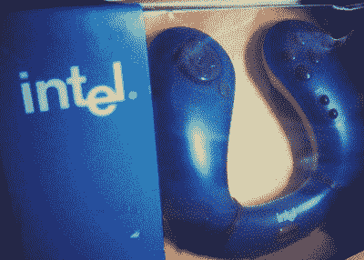

Intel Wireless Series Gamepad accessory in the retail packaging.

2000 年的生活并不像科幻小说中描述的那样让读者相信是未来的。对于机器人仆人和飞行汽车的所有承诺，现实是大多数事情仍然需要像 20 世纪那样运作。当英特尔在那年的 CES 上宣布他们的无线 PC 外设系列时，他们试图以一些小的方式改变这一点。显然，有一个无线鼠标和键盘组合展示出来，但奇怪的是，英特尔还透露了一个无线游戏控制器。英特尔一直处于处理器技术的最前沿，但视频游戏更多的是一个“意外之喜”，有助于推动他们的主要业务。

无线系列中的所有设备都通过同一个 USB 接收器连接，称为 900 MHz 频段上的“基站”。多达四台设备的混合可以同时连接，这意味着本地多人游戏最终可以在 PC 上运行，并且不需要垄断每一个 I/O。从理论上讲，设置听起来很棒，但英特尔无线系列游戏手柄的设计存在一些问题。简单地说，它看起来像一个马桶座圈。

任天堂将在几年后改进超高频频谱控制器的引入。在推出 GameCube 游戏机一年后，任天堂于 2002 年发布了 WaveBird 控制器。许多游戏玩家认为这是一个启示。能够在墙的另一边玩游戏，虽然不切实际，但在控制器发布之前，很少有人能够体验到这种自由。渴望给其他平台带来平等，像罗技这样的第三方制造商将会紧随其后，发布他们自己的无绳控制器。尽管为了增加电池寿命，这些控制器将集成 2.4 GHz 频段。

直到今天，无线控制器仍在 ISM 频段内工作。从任天堂 Wii 遥控器的蓝牙连接到 Xbox One Elite 控制器的专有协议，无线控制器将成为家用游戏机的标准而不是例外。他们提供的便利对享受当前形式的视频游戏是不可或缺的。虽然最初修补无线游戏的公司已经不在了，但修补的结果仍然存在。

## 无线是一块营销磁铁

也许没有比通过围绕无线控制器成长起来的营销活动更好的方式来重温无线控制器的发展。为此，我们今天以一些宣扬这一技术进步的广告来结束。

  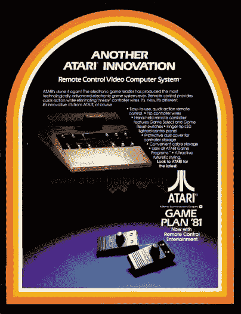Ad for Atari 2700 game console (1981)  ")Game Mate 2 Wireless Joysticks Ad (1983)  ")Nintendo AVS Ad (1984)  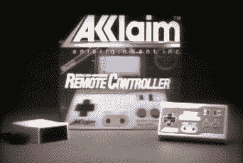Still from Acclaim Remote Controller TV Ad (1989)  ")NES Satellite Four Player Adapter (1989)  ")Acclaim Dual Turbo Controllers Ad (1993)  ")Sega Remote Arcade Pad (1994)  ")Sega Saturn Cordless Pad (1997)  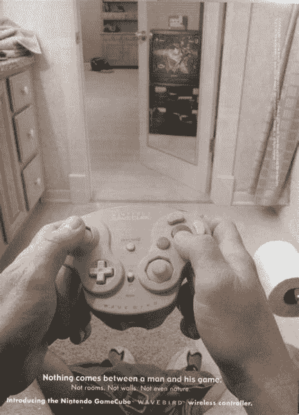Nintendo Wavebird Ad (2002)  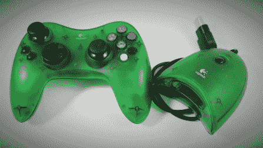Logitech Cordless Precision Xbox Controller (2003)  ")PS3 Concept “Boomerang” Controller Reveal (2005)  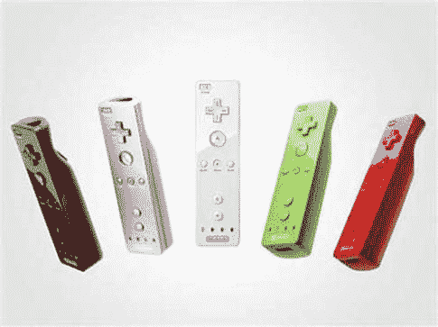Nintendo Wii Remote “Wiimote” Reveal (2006)  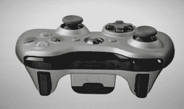Still from Xbox 360 Controller with Transforming D-Pad Ad (2011)  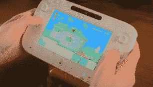Nintendo Wii U Gamepad Reveal (2011)  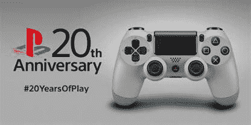PlayStation DualShock 4 20th Anniversary Promotion Still (2015)  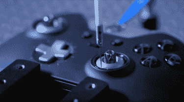Still From Xbox One Elite Controller Promo (2015)