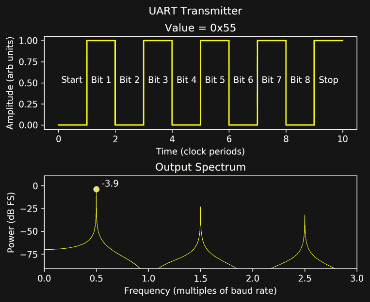

# 你的 USB 串行适配器变成了 SDR

> 原文：<https://hackaday.com/2018/12/06/your-usb-serial-adapter-just-became-a-sdr/>

说 RTL-SDR 项目是革命性的可能有点轻描淡写。使用一个便宜的 USB 小工具，并将其用作软件定义无线电(SDR ),探索从几十兆赫到千兆赫频率的无线电频谱，再加上一些开源工具，可能会成为十年来最伟大的黑客之一。但是即使在 RTL-SDR 的时代，[Ted Yapo]已经设法实现的仍然是相当不可思议的。

通过一个 Python 脚本，一段连接到 TX 引脚的电线，以及对我们凡人只能希望实现的电子的掌握，[【Ted】已经演示了使用一个普通的 USB 到串行适配器作为 SDR *发射器*](https://hackaday.io/project/162477-serial-port-sdr) 。没错，使用你几乎肯定已经放在你的零件箱里的廉价小 UART 适配器和他的软件，你可以以低兆赫频率发射，甚至通过一些诡计发射到甚高频。该项目仍然是非常实验性的，虽然这可能是第一次，我们愿意打赌这不是你最后一次听到它。

 基本思想是，当通过 UART 串行线路发送某些字符时，它们可以与起始位和停止位结合，以一半的波特率产生方波脉冲。[Ted]发现，以 19200 波特发送一串 0x55 会产生一个 9600 Hz 的连续方波，如果他将波特率一直调至 2000000，在这些 USB 适配器达到最高点时，该信号以 1 MHz 的频率传输，就在 AM 转盘的中间。

诚然，这是一个巧妙的技巧，但单独使用并不十分有用。下一步是通过 UART 发送不同的字符来调制信号。[Ted]详细解释了他的多级量化和 delta-sigma 方案实验，每一步都显示了传输音频信号的改善。总的来说，他最终想出了一种调制方案，可以产生令人印象深刻的干净信号。

仅此一点就令人印象深刻，但[Ted]还没有完成。他意识到这种传输方法会产生一些强频率谐波，远远超过他的 UART SDR 的理论最大频率 1 MHz。在他的实验中，他发现他能够接收到 151 兆赫的信号，尽管信号太差而没有任何实际用途。他稍微降低了预期，使用 FT232RL 适配器在大约 10 英尺的范围内使用 631 kHz 信号的 43 次谐波成功控制了一个便宜的 27 MHz RC 玩具，他指出，在他的测试中，这产生了最干净的信号。

[Ted]仍在致力于通过添加滤波器和放大器使传输更干净和更强，但这些早期的成就已经非常有希望了。他的工作让我们想起了低频版本的 [USB 转 VGA 适配器转 GHz SDR 发射器](https://hackaday.com/2018/04/23/spoofing-cell-networks-with-a-usb-to-vga-adapter/)，我们非常渴望看到它将何去何从。

 [https://www.youtube.com/embed/4bKLKZUTOGU?version=3&rel=1&showsearch=0&showinfo=1&iv_load_policy=1&fs=1&hl=en-US&autohide=2&wmode=transparent](https://www.youtube.com/embed/4bKLKZUTOGU?version=3&rel=1&showsearch=0&showinfo=1&iv_load_policy=1&fs=1&hl=en-US&autohide=2&wmode=transparent)

