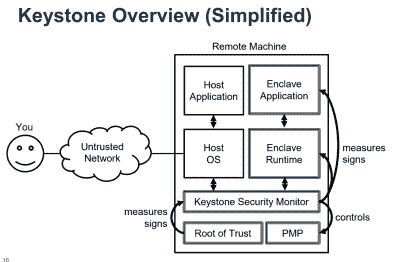
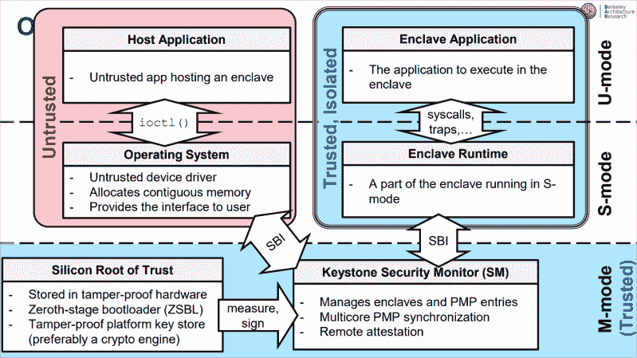

# RISC-V 将阻止黑客进入你的电脑

> 原文：<https://hackaday.com/2018/12/13/risc-v-will-stop-hackers-dead-from-getting-into-your-computer/>

有史以来最伟大的硬件黑客都是在内存中找到软件密钥的结果。AACS 加密崩溃 09 F9 密钥允许我们解密 HD DVD——是加密密钥只存在主内存中的结果，它可以被任何其他程序读取。DeCSS，让我们所有人都能接触到 DVD 的黑客又一次公开了加密密钥。

因为如果你的密钥就放在外面，加密就不起作用，所以系统设计者想出了巧妙的解决方案来防止邪恶的黑客获取这些密钥。最好的解决方案之一是硬件飞地，一个保护密钥和其他信息的微小硅片。苹果有一整个系列的芯片，英特尔有硬件扩展，所有这些都是黑盒解决方案。它们确实可以工作，但是我们不知道是否有任何漏洞。如果你不能研究它，这只是一个信念，这些硬件飞地将继续工作。

现在，可能还有另一种选择。RISC-V 研究人员正忙于创建一个开源硬件飞地。这是一个开源项目，旨在建立安全的硬件飞地来存储密钥和其他秘密信息，他们正在以一种可以被访问和研究的方式来做这件事。信任但要验证，是的，这就是为什么这是过去十年中最具创新性的硬件开发。

## 什么是飞地？

虽然作为一种新技术，处理器飞地已经存在很长时间了。第一个进入公众意识的将是 iPhone 5S 中的 Secure Enclave 处理器(SEP)。这一代 iPhone 引入了几项重要的技术进步，包括触控 ID、创新和革命性的 M7 运动协处理器以及 SEP 安全协处理器本身。iPhone 5S 是一个技术里程碑，当时 SEP 存储的指纹数据和密钥超出了 iPhone 中的实际 SOC。

iPhone 5S SEP 旨在为 SOC 的其余部分执行安全服务，主要与触控 ID 功能相关。随着 2016 年 Touch Bar MacBook Pro 的发布和苹果 T1 芯片的使用，苹果对安全 enclave 处理器的革命性使用得到了扩展。T1 芯片再次用于 TouchID 功能，并证明了苹果是垂直集成之王。

但苹果并不是唯一一家为其计算产品开发安全领域的公司。[英特尔开发了 SGX 扩展](https://software.intel.com/sgx)，支持硬件辅助安全领域。这些飞地使开发人员能够将密钥和数字版权管理组件隐藏在受硬件保护的硅片中。AMD 也有安全加密虚拟化(SEV)的硬件飞地。ARM 拥有可信的执行环境。虽然英特尔、AMD 和 ARM 飞地是在其他硅片上的硅片，与苹果将硬件飞地放在全新芯片上的方法不同，但想法是相同的。你想把安全的东西放在安全的环境中，enclaves 可以让你做到这一点。

不幸的是，这些硬件飞地是黑匣子，虽然它们确实提供了一个小的攻击面，但也存在问题。众所周知，AMD 的 SEV [存在严重的安全漏洞](https://arxiv.org/pdf/1805.09604.pdf)，并且据信 SEV 无法提供针对恶意虚拟机管理程序的保护，只能防范意外的虚拟机管理程序漏洞。英特尔的管理引擎虽然没有明确地成为硬件飞地，但[已被证明易受攻击](https://hackaday.com/2017/05/02/is-intels-management-engine-broken/)。问题是，这些硬件飞地是黑盒，通过模糊实现的安全性根本不起作用。

## 开源解决方案

在上周的 RISC-V 峰会上，加州大学伯克利分校的研究人员发布了他们的 Keystone Enclave 计划，这是一个基于 RISC-V 的开源安全飞地。Keystone 是一个基于 RISC-V 架构的安全硬件飞地构建可信执行环境(TEE)的项目，该架构将用于完全开源的微控制器和(即将推出的)片上系统。

Keystone 项目的目标是建立信任链，从存储在防篡改硬件中的信任硅根开始。这导致了零级引导加载程序和防篡改平台密钥存储。定义硬件信任根(RoT)异常困难；你总是可以解封硅，你总是可以对芯片进行某种分析来提取密钥，如果你的供应链管理不善，你就不知道你所依赖的芯片实际上是不是你电脑中的芯片。然而，通过使用 RISC-V 及其开源 HDL，至少可以研究这种 RoT，而不像英特尔、AMD 和 ARM 供应商的黑盒解决方案。

Keystone 目前的计划包括内存隔离、一个用于在这个安全飞地之上构建的开放框架，以及一个用于安全飞地的最小但开源的解决方案。

现在，Keystone Enclave 可以在各种平台上测试，包括 QEMU、FireSim 和 SiFive Unleashed 的真实硬件。还有很多工作要做，从正式验证到构建软件栈、库和添加硬件扩展。

这是一个改变游戏规则的安全措施。近十年来，硅供应商和设计者一直在处理器中硬塞进硬件飞地，苹果甚至创造了自己的飞地芯片。所有这些解决方案都是黑盒，没有第三方验证这些设计本质上是正确的。RISC-V 项目是不同的，Keystone Enclave 是我们创建一个可以独立研究和验证的真正开放的硬件 Enclave 的最佳机会。