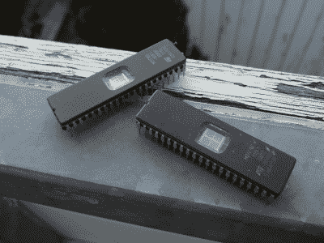
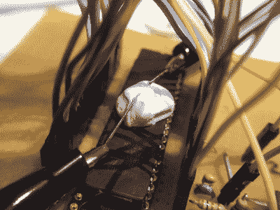
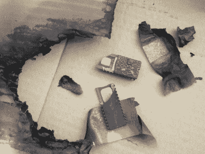
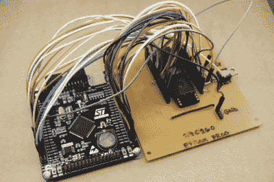

# 本周失败:EPROMs、老鼠窝、晒黑灯和纸板着火

> 原文：<https://hackaday.com/2019/01/02/fail-of-the-week-eproms-rats-nests-tanning-lamps-and-cardboard-on-fire/>

这一切都是从我买了一台需要升级固件的 90 年代末的合成器开始的。人们可以在 2003 年简单地取出 ROM 芯片，运到雅马哈免费更换，换上新的。缺乏时间机器，一个明智的选择是在易贝花 10 美元买一个预编程的售后 EPROM，如果你只是想要一个预闪存 EPROM，那可能是正确的方法。但是我想要一次冒险。

剧透警告:我*设法刷新了一些 EPROMs，RM1X 很高兴运行 OS 1.13 并排除了堵塞。那不是冒险。冒险号试图清除紫外线可擦除的 EPROMS。*

 *这就是为什么我最后得到了一个小纸板火和一个烧焦的晒黑灯，为什么我买了一个 5 美元的 LED，为什么我把 EPROMs 放在太阳底下晒了四天。以及为什么，最后我放弃了，从中国订购了 15 美元的 EPROM 橡皮擦。一路走来，我学到了很多关于老式紫外线可擦除 EPROMs 的知识，现在我有一堆过时的硅片正在寻找一个新项目，就像锤子寻找钉子一样——只要紫外线擦除器一收到邮件。

## 过去的闪光:紫外 EPROMs

老式的 EPROMs 是通过在集成电路中布置一堆场效应晶体管(fet)制成的。在读取模式下，栅极电压被施加到每个晶体管，它是否导通决定了存储在那里的数据位是 1 还是 0。诀窍是在 FET 的沟道和栅极之间插入一个额外的金属层——浮动栅极。将负电荷放在这个浮动中间层上，将提高从外部开启晶体管所需的电压。因此，一点信息可以以多余电子的物理形式存储在浮栅上。

在紫外 EPROM 中，浮栅的四周被氧化层绝缘，所以它基本上无限期地保留着负电荷。你可以通过“热电子注入”让额外的电子进入浮栅:在浮栅上施加足够的电压，使电子跳过绝缘层。当读取数据时，具有负电荷栅极的晶体管在其正常栅极电压下不会导通，而那些没有被编程的晶体管会导通。很简单。

但是，为了清空 EPROM，如何去除多余的浮栅电子呢？最初提议擦除陶瓷封装的 EPROMs 的方法是在 600 摄氏度的烤箱中使用 X 射线，但更冷的头占了上风，芯片制造商安装了一个相对昂贵的紫外可透过的晶体窗口，允许更长波长的致癌光将电子诱回到基板中。显然，在 20 世纪 70 年代，强紫外线灯因其杀菌效果而普遍用于理发店等场所，因此拥有一个紫外线可擦除的 EPROM 是很方便的。我自己清除紫外 EPROMs 的尝试从来没有成功过。

## 如何不清除 EPROM

我订了十包二手的(！)27C160 UV EPROMs 联机，当 10 个中只有 3 个内存被清空时，我有点吃惊。除非我能弄清楚如何清空 UV EPROM，否则我只有三次机会刷新我的 synth 的 EPROM。因为我有一个 ROM 转储，其中有 16 位字节顺序未知的字，所以有 50%的可能性我需要尝试两次。这使我只剩下一个 EPROM 来开发 EPROM 编程器。所以我决定看看我是否能抹去它们来给自己提供一个安全网。

就在这几页里，我读到了用紫外线发光二极管和 T2 利用太阳能成功擦除紫外线 EPROMs 的故事。我的 EPROM 的数据表规定“波长短于 400 纳米”，并建议“使用 12 毫瓦/厘米 ² 额定功率的紫外灯 30 到 40 分钟。”它还表明，直接暴露在阳光下大约一周就足够了。因此，这些平凡的故事表面上听起来似乎有理。

也许德国南部 11 月的阳光不会像南加州或任何数据表上写的地方那样充满整个夏天的紫外线，但我放在阳台上的两个芯片在暴露一周后显示的数据与之前完全相同。一点儿也没变，整整四天都是晴天。也许是因为寒冷？我询问了 Hackaday 总部，Jenny 说她试过一次，用了三周或更长时间，在英国度过了一个夏天。这显然不是捷径。

所以我试着从我的垃圾箱随机紫外线 LED，什么也没有得到。真正的紫外发光二极管制作困难且昂贵，这个非常明显是蓝色的。因此，尽管它无法擦除我桌上的 EPROM，我还是邮购了一个更有可能做到这一点的东西:一个 5 美元的 375 纳米日亚紫外二极管。这是一个 375 纳米的 6 兆瓦设备，而不是汞基杀菌灯泡使用的 254 纳米的 12 兆瓦，但这是我以合理的价格获得的最短波长，数据表上说“低于 400 纳米”，对吗？

 嗯，还挺对的。好消息是有些部分被翻转了。24 小时后，大约有 10，000 个位元被读取出来，这些位元之前是零。坏消息是，一个 EPROM 翻转了几千位，导致数据损坏，而一个 EPROM 丢失了所有 2，097，152 位，是一张白纸，两者之间有很大的区别。

从数据表来看，曝光曲线应该是 S 形的:最初极少数位翻转，然后大多数翻转，过一会儿最后不情愿的位让步。有了这一排山倒海的承诺，我让 LED 以 15 mA 的额定电流运行了四天。每次我检查芯片时，它都有进展，但进展很慢。与一个合适的紫外线橡皮擦承诺的 40 分钟相比，这个时间太长了。也有可能这些用过的芯片有些磨损，无论如何需要更多的劝说。

## 然后我放火烧东西

然后我突然想到！大约七年前，我婆婆把她的旧日光浴灯藏在了我们的地下室，从那以后，它就一直占据着空间，收集着锯屑。晒黑灯使用与杀菌灯相同的水银紫外线灯泡，但是它们将紫外线传播到更广的区域——人体。不过，如果我能把 EPROM 放在离灯泡足够近的地方，它可能会工作。所以我抓了些硬纸板做支撑，把 EPROM 直接贴在灯上，点燃了灯。

 我后来了解到晒黑灯也有一个大的红外加热元件来模拟太阳的变暖效应。不建议将纸板贴在阳光下。过了五分钟，老婆问我什么东西有烟味，我就开始往楼下跑。当我到达时，地板上有一个热坏的 EPROM，她正在踩灭纸板火。戏剧性！我们给房子通了风，那天晚上我订购了一个 15 美元的进口 EPROM 橡皮擦。

为了不被击败，我还制作了一个铝制框架，可以将 EPROM 固定在晒黑灯的防护罩上，但在三次 30 分钟的会议后，没有一个比特被翻转。晒黑灯中的紫外线可能被过滤或散焦到足以对人类皮肤更安全，而不适合清除 EPROMs。无论如何，它没有输出我需要的 12 mW / cm ² 。所以我地下室的癌症机器仍然是我脖子上的一个包袱。

## EPROMs 编程非常简单

我开始了这次 EPROM 清理之旅，因为我从易贝订购的 10 个中只有 3 个空白。幸运的是，对它们进行编程就像阅读数据手册并按照说明操作一样简单。基本上，你需要一个奇怪的电压源对 EPROM 进行编程:12 V 用于热电子注入，6.5 V 用于在验证过程中提供一点余量——如果 FET 在 6.5 V 时不打开，那么它肯定不会在栅极上的标称 5 V 工作电压下打开。最后，您需要一种方法来设置芯片的地址和数据引脚，但如果您对微控制器很熟悉，这没什么大不了的。

我的旧合成器使用 27C160 EPROMs，这是 EEPROM 出现之前制造的最后一种芯片，带有一个额外的“E ”,代表“电可擦除”存储器。因此，27C160 可以存储仍然令人印象深刻的 2 MB，寻址为 1，048，576 个 16 位字。这意味着它有 16 个输出引脚和 20 个地址引脚，外加两个需要选通以分别闪烁和验证数据的引脚。GPIO 太多了！

 我有一些[黑色 STM32F407 分线板](http://wiki.stm32duino.com/index.php?title=STM32F407)，我将它们用于高 GPIO 数项目，因为它有三个 16 引脚的端口，每个端口基本上都是免费使用的，这意味着我不必费力考虑这些位去哪里或连接移位寄存器。EPROMs 是为老式的 [TTL 逻辑电平](https://en.wikipedia.org/wiki/Logic_level)设计的，所以你甚至可以使用没有电平转换器的 3.3 V 微控制器！

我使用的固件同样简单，只需通过串行线路读入一个值，同时计算地址并在 GPIO 引脚上设置它。切换验证引脚可确保目标值“生效”。我喜欢在[到](https://hackaday.com/2017/04/19/moving-forth-with-mecrisp-stellaris-and-embello/)中编写类似这样的简单项目，因为我可以交互地编写和调试代码，然后通过从我的笔记本电脑的串行线路上发送相同的文本命令来自动化事情，在那里我可以用 Python 编写难的东西。因此，笔记本电脑端的代码通过串行发送类似于`12345 000000 program`的消息，然后第四个系统自动返回一个“ok”当它已经编程并验证了该字时。每个单词只花了大约 15 毫秒，这听起来还不错，直到你把它乘以一百万，得到大约 4.5 小时。哦，好吧，我正要写一个程序。或者两次，如果我搞砸了。

它很丑，但是如果你想看一看，它就在 GitHub 上。很简单。

最后，我设法只用一个芯片来编码和验证我的编程器固件，这样就剩下两个空白的 EPROMs 来刻录一个 ROM 映像。当然， [Muphry 定律](https://en.wikipedia.org/wiki/Muphry%27s_law)出现了，我在互联网上找到的 OS ROM 数据是以大端存储的，我最初猜测是以小端存储的，所以我不得不烧掉我剩下的最后一个空白 EPROM。

## 锤子找钉子

EPROMs 因其简单而吸引人。与现代的双 E EEPROM[不同，这里没有任何协议](https://hackaday.com/2018/01/18/reading-out-an-eprom-with-dip-switches/)。只需在引脚上施加地址电压，解码器就会设置 16 个 FET 栅极，这些微小的 FET 中有些会打开，有些则不会。所有这一切都发生在几十纳秒内。[任何 20 位的模式都可以映射到任何 16 位的模式](http://213.114.131.21/eprom/e-pla-00.htm)。那是记忆！

现在，一旦 UV 橡皮擦到达，我该如何处理剩余的 EPROMs 呢？它们的寿命和适度的隐蔽性可能使其成为存储秘密密钥材料的好地方。也许我会把装有我的 GPG 钥匙的 EPROM 和打印出来的文件一起放在保险箱里？或者用它们作为超级复古书呆子的秘密解码戒指？或者取一些旧的、历史上准确的鼓机样品，然后烧成灰烬，重新制作一个林纳鼓？连接一个梯形 DAC 并构建一个 16 位分辨率的任意波形发生器？十六个输出对我来说是一个十六段的显示查找表，但是对于一个 20 位的地址空间，我可以为每一个可能的字形存储 16 次。这似乎很荒谬。

你会用一小堆 EPROMs 做什么？你会如何抹去它们？

[尾声:15 美元的 UV 橡皮擦到了，在 15 分钟内做了它应该做的事情，没有任何东西着火。]*