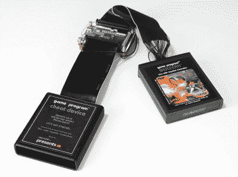

# FPGA 黑客成为雅达利游戏精灵

> 原文：<https://hackaday.com/2018/12/11/fpga-hack-becomes-an-atari-game-genie/>

游戏精灵是 90 年代早期视频游戏场景的经典。这就是为什么你会击败忍者神龟游戏，这就是为什么你的 NES 连接器不能正常工作。然而，他们从来没有为雅达利 2600 设计过游戏精灵，因为当游戏精灵发布的时候，雅达利已经在玩具反斗城的货架上奄奄一息了。现在，我们有了 FPGAs 和开发工具。我们可以自己造。这正是[Andy]所做的，他为 2600 开发的游戏精灵和你能为这款备受困扰的游戏机找到的任何商业产品一样好用。

为了理解如何为 Atari 构建游戏精灵，你首先必须理解游戏精灵是如何工作的。游戏精灵的黑客通过替换游戏 ROM 中的一个字节来工作。例如，如果您的生命存储在内存位置 0xDEAD，您只需将该字节从 3(缺省值)更改为 255(因为它是无限的，或者其他什么)。将这与 6 个字母和 8 个字母的代码结合起来，这两个代码表示要更改哪个字节以及要将其更改为什么，这样就有了一个游戏精灵。

 这一构建始于设置一个 DE0 Nano FPGA 开发板来连接一个 Atari 2600 墨盒。是的，存在电压电平差异，但这可以通过几个引脚分配来解决。然后，只需编写 Verilog 将所有数据从一组地址和数据引脚传递到另一组地址和数据引脚。如果你愿意，FPGA 变成了中间人攻击。

由于 FPGA 充当墨盒上连接的通道，将欺骗硬编码到设备中是一件简单的事情。例如，[Andy]找到了一个游戏的代码，找出了火球的颜色被定义为红色的地方，并将颜色改为蓝色。它起作用了，世界一切正常。这项工作随后继续创建一个用户界面，输入三个作弊代码，最后包装在一个 3D 打印的外壳中。当然，Atari Game Genie 可以使用带状电缆，但是使用 Lock-On 技术创建一个类似的项目并不困难。你可以在下面查看整个构建视频，或者在 [Element14](https://www.element14.com/community/docs/DOC-91313) 获取信息

 [https://www.youtube.com/embed/lXTxKD8-ghg?version=3&rel=1&showsearch=0&showinfo=1&iv_load_policy=1&fs=1&hl=en-US&autohide=2&wmode=transparent](https://www.youtube.com/embed/lXTxKD8-ghg?version=3&rel=1&showsearch=0&showinfo=1&iv_load_policy=1&fs=1&hl=en-US&autohide=2&wmode=transparent)

