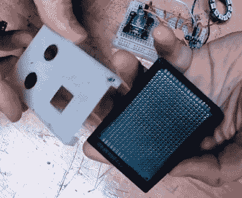

# 每台计算机都配有旋转编码器

> 原文：<https://hackaday.com/2018/12/13/every-computer-deserves-a-rotary-encoder/>

在触摸屏和电容式按钮的时代，如果我们说我们没有偶尔怀念过去的美好时光，那是在撒谎，那时与设备的交互更有份量。物理开关的沉闷金属声似乎永远不会过时，虽然如果你想在发出愤怒的推特时听到优美的断奏声，你可以随时为你的电脑选择一个机械键盘，但除此之外，机械接口设备肯定很缺乏。

 【杰里米·库克】决定通过[设计他自己的多用途 USB 旋转输入设备](https://github.com/JeremySCook/RotaryControl)将事情掌握在自己手中(字面上和象征上)。它不是鼠标或键盘的替代品，而是桌面的第三个支柱，提供了一种独特的控制软件的方式。它自然适合控制音量或任何其他变量，这些都将受益于一些微调，但正如视频中演示的那样，盈亏平衡后也有一些游戏应用。毫无疑问，Hackaday 的好读者可以为这样的小工具想到更多潜在的应用。

该设备是围绕 MellBell 的小型 Arduino 兼容 PICO 板构建的，该板具有 ATmega32u4 和原生 USB。这使他能够非常快速地旋转 USB 人机接口设备(HID ),而最少的麻烦是，他所要做的就是将他的按钮和旋转编码器挂在 PICO 的数字引脚上。为此，他[Jeremy]使用了由[fattore.saimon] 设计的[神奇的 I2C 旋转编码器，读者可能记得这是 2018 年 Hackaday 奖*开放硬件设计挑战赛*阶段的决赛作品。他还在编码器周围添加了一个新像素环，用于一些视觉反馈，因为它看起来很酷。](https://www.tindie.com/products/Saimon/i2cencoder-v2-connect-multiple-encoder-on-i2c-bus/)

由于所有的核心元件都是数字的，所以不需要大量的布线或无源元件。这让[Jeremy]可以将整个东西放在一块 perfboard 上，让他腾出时间来设计配有半透明盖子的 3D 打印外壳，这样他就可以看到 NeoPixel 闪光灯。他将公差控制得足够紧，以至于整个设备可以整齐地压配合在一起，甚至想到在外壳底部增加孔，以便他可以在需要时将 perfboard 推出来。

[Jeremy]在视频中花了很大一部分时间讲述软件设置和固件开发，并详细描述了他在使用 I2C 编码器时不得不考虑的一些细微差别。他还解释了让他的编码器模拟鼠标光标在圆周上移动所涉及的数学，他认为这在模拟最初使用编码器的游戏时会很有用，如 *Tempest* 或 *Pong。*

我们过去已经见过类似的 USB“旋钮”用于控制音量，但[Jeremy]在他的版本中内置的额外输入无疑使它更加实用。当然，从开始，我们就对[有趣的 USB 输入设备趋之若鹜。](https://hackaday.com/2017/10/03/a-vintage-morse-key-turned-into-usb-keyboard/)

 [https://www.youtube.com/embed/ePKGLnjlXl4?version=3&rel=1&showsearch=0&showinfo=1&iv_load_policy=1&fs=1&hl=en-US&autohide=2&wmode=transparent](https://www.youtube.com/embed/ePKGLnjlXl4?version=3&rel=1&showsearch=0&showinfo=1&iv_load_policy=1&fs=1&hl=en-US&autohide=2&wmode=transparent)

