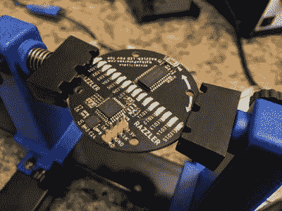

# 视点超越了业余爱好者的能力

> 原文：<https://hackaday.com/2018/12/29/pov-tops-hobbyist-abilities/>

有时候，一个漂亮的项目仅仅因为它的优点就值得一写，但是当它像设计的那样运行时，有人花时间为他们的项目创建一个完整而漂亮的登陆页面，我们会感到无力。我们觉得有必要抓住互联网，用手指着大家看。这是那些检查我们所有箱子的项目之一。[Nathan Petersen]制作了一个名为 Razzler 的 POV 玩具陀螺，一路上跳过每个原型环。他保存的文件抓住了我们的心。

该项目是一个带有集成视觉暂留(POV)显示器的旋转陀螺。这就是你在这里看到的发光二极管线。为了同步模式，电路板包括一个 IMU，但用陀螺仪或加速度计检测角速度被证明是有问题的。[Nathan 的]这方面的文章本身就值得一读，但你也会喜欢这个项目中用于创建旋转陀螺主体的 CNC 工作部分。

这是[内森]的第一个大型个人项目，许多步骤都是由一个刚刚很快进入深水区的人来解释的。如果你有经验，你可能会对这些简单的推理嗤之以鼻，但对于新手来说，这是一堂平易近人的课。他选择硬件和固件的方式是务实的，甚至可能是矫枉过正的，所以你知道他要进入工程领域。当出现需要牺牲一些处理能力来在一些 GPIO 上运行 I2C 的通信问题时，这个溢出救了他。

我们希望你喜欢阅读这种观点、固件([的组合，是吗？](https://hackaday.com/2017/09/29/were-using-the-word-firmware-wrong/))，以及[离心力](https://hackaday.com/2011/03/26/papercraft-gyroscope/)。