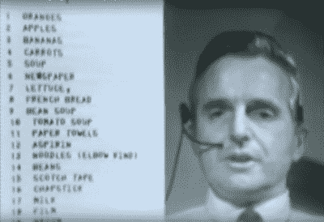
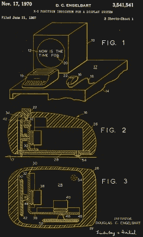
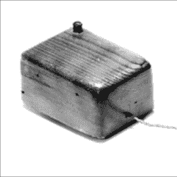
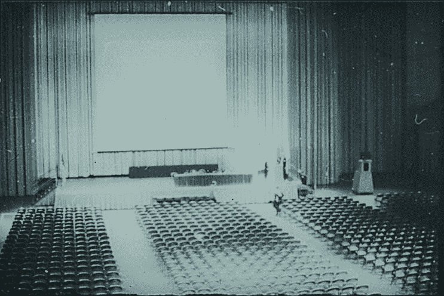

# 所有民众之母，50 年过去了

> 原文：<https://hackaday.com/2019/01/03/retrotechtacular-the-mother-of-all-demos-50-years-on/>

如果你像我一样，很有可能你已经被告知，现代计算机用户界面的所有元素——在窗口中运行的程序、菜单、图标、文本文档的所见即所得编辑，当然还有古老的计算机鼠标——都起源于 20 世纪 70 年代早期施乐公司帕洛阿尔托研究中心的神圣大厅。毫无疑问，PARC 开发了这些技术以及更多技术，包括激光打印机和面向对象的编程，所有这些技术首先照亮了世界上的工作场所，然后是普通人的家庭。

但是，如果没有一个对计算有着独到见解的人的构想，这些技术都不会存在。道格拉斯·恩格尔巴特描绘了一个未来，在这个未来中，计算机是增强人类解决世界问题所需的智力优势的工具，他着手发明允许这样做的系统。阅读 Twitter feed 或浏览 YouTube 评论，人们可以争论恩格尔巴特的愿景实现得有多好，但无可争议的事实是，他发明了几乎所有现代人机交互的装饰，并在一次大规模演示中将其赋予世界，这被称为“所有演示之母”。

## 对美好未来的憧憬

Douglas Engelbart during the Mother of all Demos.

虽然所有演示之母发生在 1968 年，但它的起源要追溯到 20 多年前，菲律宾的一个小草屋。在冷战初期，一名担任美国海军雷达技术员的年轻人偶然看到了万尼瓦尔·布什的一篇名为《正如我们所想》的文章。在这篇文章中，布什描述了他对信息机器的设想，它可以作为一个集体记忆装置，引发人类知识的爆炸。

对道格·恩格尔巴特来说，布什的文章是令人兴奋的东西，他在俄勒冈州立大学的本科学习被他的服役号召打断了。当他回来时，他完成了电子工程学位，并计划与他的大学恋人结婚。像许多退伍军人一样，他计划着“结婚，找份好工作，过上好日子”的模式，但这种模式让他感到困扰。1950 年，他为自己的人生规划了另一条道路，即通过布什在文章中描述的那种信息系统，利用人类的智慧，致力于让世界变得更美好。恩格尔巴特认为，只有通过组织人类知识并提供便捷的获取途径，他才能实现解决世界问题的目标。

恩格尔巴特在 20 世纪 50 年代前半期在伯克利从事研究生工作。凭借电气工程博士学位，他开始着手实现自己的愿景。1957 年，他来到了位于加州门洛帕克的斯坦福研究所。来自国防高级研究计划局(DARPA)的资金使他有可能创建增强研究中心(ARC)，这是研究所内的一个实验室，致力于将他的信息社会愿景变为现实。

## 重塑计算机硬件

US Patent 3,541,541\. The mouse is born,

这一努力让他度过了 20 世纪 60 年代，因为 ARC 努力开发技术，将计算机从充满只能由专家操作的设备的房间变成可以促进个人智力发展的系统。当时的硬件根本无法胜任运行他的“在线系统”或 NLS(这个笨拙的缩写是因为需要将其与实验室中的前身离线文本系统或 FLTS 区分开来)的任务。当系统开始做比组织文本更多的事情时，“文本”部分最终被丢弃)。NLS 将是所有民众之母背后的系统。

整个 20 世纪 60 年代，NLS 的发展在实验室能接触到的各种机器间跳跃。从西摩·克雷设计的 CDC 160A 开始，到 2015 年左右，NLS 转向了功能更强大的 CDC 3100。这让 Engelbart 的团队为 NLS 增加了更多的功能，最终将在演示中看到，如窗口，超文本标记的前身，简单的绘图程序，数据的层次结构，甚至视频会议的开端。

Mouse prototype built by Bill English from Douglass Engelbart’s sketches (Bill is pictured at the top of this article, preparing for the Mother of all Demos)

为了促进这一切，恩格尔巴特发明了一种装置，他在 1967 年申请了“X-Y 位置指示器”的专利。该设备由首席工程师 Bill English 用一块木头和一对连接到光学编码器的金属轮制成，因其长尾巴而被 Engelbart 称为“鼠标”。该实验室还建造了其他独特的硬件，如和弦键盘(每个命令使用多个手指)，用于在 NLS 中确认和中止命令。

## 演示时间

到 1968 年，所有这些都在 SDS 940 分时计算机上运行。这台机器提供了第一次公开展示恩格尔巴特系统所需的马力。所有 Demos 之母都会全力以赴。这将是旧金山秋季联合计算机会议的现场演示。大厅里安装了大型电视监视器，既可以显示 NLS 的屏幕，也可以显示恩格尔巴特讲述演示时面部的实时视频叠加。微波链路在 48 公里外的门洛帕克和旧金山之间传输视频，一个临时搭建的调制解调器将演示终端连接到实验室的 SDS 940。

虽然按照今天的标准，我们不会把视频质量称为值得大书特书的东西，但演示没有出现任何重大的技术故障，考虑到有多少事情可能会出错，这是一个小小的奇迹。恩格尔巴特发表了一个半小时，展示了他对未来“智力工作者”如何与计算机互动的设想。关于演示的一切都是我们现在在系统中看到的，从光标在屏幕上跳来跳去到程序在独立窗口中弹出的方式。在仅仅 100 分钟的时间里，未来 50 年计算机发展的整个基础清晰而令人信服地被奠定了。

Think your last demo was big? The hall where the Mother of All Demos was held. Source: [The Doug Engelbart Institute](http://www.dougengelbart.org/)

在整个过程中，道格·恩格尔巴特平静而自信地注视着与会者。你可以清楚地看到，他在某些时候非常享受自己，即使他偶尔犯了个错误，或者问了个反问，“现在在哪里？”同时寻找按键和鼠标点击的正确组合来完成任务。这种自信来自于只有它的发明者才能拥有的对一个系统的深入了解，知道它的怪癖和弱点以及如何与之相处。

当然，整个视频值得一看，但对于那些没有时间投入的人来说，道格·恩格尔巴特研究所(T1)已经好心地(T2)将视频切割成更易于管理的片段(T3)。至少有几个视频是值得一看的，因为它们让我们一瞥一项惊人的成就和我们与计算机对话方式的巨大飞跃。这一切都是在半个世纪前完成的，并在大量观众面前现场表演，这使它更加不可思议。

 [https://www.youtube.com/embed/yJDv-zdhzMY?version=3&rel=1&showsearch=0&showinfo=1&iv_load_policy=1&fs=1&hl=en-US&autohide=2&wmode=transparent](https://www.youtube.com/embed/yJDv-zdhzMY?version=3&rel=1&showsearch=0&showinfo=1&iv_load_policy=1&fs=1&hl=en-US&autohide=2&wmode=transparent)

