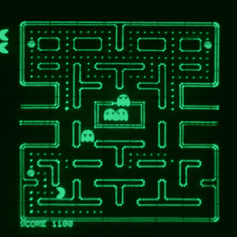

# 美味矢量游戏机运行吃豆人，俄罗斯方块，和马里奥

> 原文：<https://hackaday.com/2018/12/26/delicious-vector-game-console-runs-pac-man-tetris-mario-and-then-some/>

我们对[mitxela]的 [DIY 矢量图形游戏主机](https://mitxela.com/projects/console)的唯一疑问是:为什么他等了五年才向世界公布？

从我们之前看过的项目来看，从[他的小 LED 耳环](https://hackaday.com/2017/02/12/tiny-led-earrings-are-a-miniaturization-tour-de-force/)到将 MIDI 合成器塞进[的 DIN 插头](https://hackaday.com/2016/03/30/the-attiny-midi-plug-synth/)以及后来的[USB 插头](https://hackaday.com/2016/05/08/smallest-midi-synth-again/)，【mitxela】喜欢挑战。当这些项目正在进行的时候，你将在下面的视频中看到的游戏控制台被放在架子上，与世隔绝。太遗憾了，因为这是一个很棒的建筑。

使用 X-Y 模式的 CRT 示波器作为矢量显示，主机忠实地再现了一些经典游戏，其中大部分，说来也奇怪，最初并不是矢量游戏。有来自*时间分裂者 2* 的*蟒蛇*、*倒退者*和*太空人*迷你游戏的实现。还有*吃豆人*、*俄罗斯方块*，甚至*超级马里奥兄弟*的版本。大多数游戏在被翻译成汇编并放在 EEPROM 外部盒式存储器上之前都是用 JavaScript 制作的原型，由游戏机内部的 ATMega128 读取。声音和音乐是利用 ATMega 的硬件定时器产生的，一个用于白噪声的反向偏置晶体管和几个运算放大器提供了一点帮助。

对于一个声称在项目开始时对电子学知之甚少的人来说，这是非常令人印象深刻的东西。我们唯一的吹毛求疵是延迟告诉我们，以及缺乏小行星的实施。不过，前者是可以原谅的，因为文档如此详尽，项目又如此酷。后者？希望如此。

 [https://www.youtube.com/embed/dTGOEe8f8ls?version=3&rel=1&showsearch=0&showinfo=1&iv_load_policy=1&fs=1&hl=en-US&autohide=2&wmode=transparent](https://www.youtube.com/embed/dTGOEe8f8ls?version=3&rel=1&showsearch=0&showinfo=1&iv_load_policy=1&fs=1&hl=en-US&autohide=2&wmode=transparent)

感谢[Keith Fulkerson]的提醒。