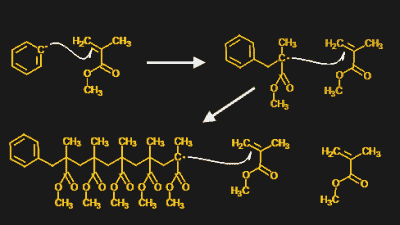
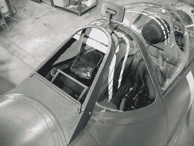

# 塑料:丙烯酸

> 原文：<https://hackaday.com/2019/01/16/plastics-acrylic/>

如果有什么东西比桦木胶合板更经常出现在业余爱好者级激光切割机的床上，那可能就是丙烯酸板。看着激光束在一片晶莹剔透的东西上扫过，蒸发掉一条头发丝般宽的线，并(希望)留下一个火焰抛光的切口，这种感觉有一种奇怪的满足感。

丙烯酸，更确切地说是聚甲基丙烯酸甲酯或 PMMA，是一种神奇的材料，在被开发用于和平用途之前，它帮助赢得了一场战争。它有一些有趣的化学和属性，非常适合在家庭商店中使用，从简单的外壳到激光切割零件，如齿轮和链轮。

## 自由基

像世界赖以存在的许多聚合物一样，PMMA 在 20 世纪初首次商业化。不过，塑料的起源要追溯到更远的地方。包括甲基丙烯酸在内的丙烯酸是在 19 世纪中期首次合成的。甲基丙烯酸甲酯(MMA)是制造 PMMA 的单体，在那个世纪后期首次合成，第一次成功的聚合发生在 1874 年。

聚合甲基丙烯酸甲酯的关键是两个碳之间的双键。这种键是乙烯基官能团的一部分，其他塑料如聚氯乙烯的名称也由此而来。在 PMMA 的情况下，MMA 单体在引发剂化合物的存在下一起反应，如过氧化苯甲酰-是的，[即过氧化苯甲酰](https://en.wikipedia.org/wiki/Clearasil)。引发剂的工作是提供大量的自由基或不成对电子。自由基贪婪地吸收双键中多余的电子，将其还原为单键，并将 MMA 单体连接到引发剂上。但生成的分子本身就是自由基，可以还原附近 MMA 单体的双键，生成另一个自由基。最终，链式反应会失去动力，但这是在 PMMA 长链产生之前。

Free-radical polymerization of MMA into PMMA. The ring structure is the initiator, which reduces the carbon-carbon double bond in MMA monomer. That creates another free radical, which reduces another MMA, and so on. The chain reaction eventual terminates, leaving long strands of PMMA.

## 塑料之战

在最初的聚合反应被发现 50 多年后，PMMA 才变成商业产品。20 世纪 30 年代初，英国和德国的化学家独立研究聚甲基丙烯酸甲酯。为帝国化学工业工作的希尔和克劳福德的英国团队完善了一种生产“丙烯酸玻璃”的方法，该公司后来将这种玻璃作为有机玻璃推向市场。有机玻璃比普通玻璃更轻、更坚固、更透明，作为一种热塑性塑料，可以通过压力或真空成型为复杂的形状。民用飞机制造商急切地采用它来减轻重量，使他们的飞机更符合空气动力学。在第二次世界大战前夕，军用飞机设计师也利用了有机玻璃的特性。

Acrylic glass bubble canopy on a Supermarine Spitfire. Source: [The Spitfire Site](http://spitfiresite.com/)

在德国方面，化学家奥托·罗姆(Otto Rohm)是工业巨头罗门哈斯(Rohm & Haas)的联合创始人，他对自己的工艺采取了不同的方法。他看到了普通玻璃和 PMMA 复合材料的价值，在两片玻璃之间夹了一层聚合物。他认为，如果他能在两片玻璃之间进行聚合反应，PMMA 就能把整个三明治粘合成一片固体。遗憾的是，他无法做到——玻璃总是从 PMMA 上剥落。但这给他留下了完美的丙烯酸玻璃片，具有有机玻璃的所有特性。他将自己的产品命名为有机玻璃，它将和有机玻璃一样在民用和军用领域得到广泛应用。

PMMA 在战争的严峻考验中证明了自己，并准备利用战后消费品的繁荣。从厨房用具到汽车仪表板，丙烯酸树脂的应用无处不在，而作为水悬浮液，PMMA 通过允许在表面上涂上耐用的塑料涂层，彻底改变了涂料工业。还发现 PMMA 在很大程度上是生物相容的，并成为整形外科假体(如人工髋关节和膝关节)的流行的主要骨水泥。

## 切割它，弯曲它，粘合它

对于家庭游戏玩家来说，PMMA 在设计和构建项目方面提供了很大的灵活性。虽然用于 3D 打印机的 PMMA 细丝并非不为人知，但它几乎没有 PLA 和 ABS 的追随者。PMMA 主要作为激光切割机和雕刻机的原料。鉴于其光学清晰度，激光可以切割 PMMA 似乎很奇怪，但聚合物实际上吸收了二氧化碳激光器发出的红外波长，足以烧穿它。网上有许多激光切割丙烯酸树脂的指南，但一般规则是尽快清除蒸发的 PMMA，最好是通过向下通风的工作台。释放出来的气体不仅有毒——想想甲醛、一氧化碳和原始单体 MMA——而且易燃。让它到处燃烧只会引起问题。一些激光切割机还使用气体辅助，用温和的氮气流或压缩空气轻轻吹走蒸汽，以帮助获得光学清晰、火焰抛光的切割。

 [https://www.youtube.com/embed/dkD-9ASIr-s?version=3&rel=1&showsearch=0&showinfo=1&iv_load_policy=1&fs=1&hl=en-US&autohide=2&wmode=transparent](https://www.youtube.com/embed/dkD-9ASIr-s?version=3&rel=1&showsearch=0&showinfo=1&iv_load_policy=1&fs=1&hl=en-US&autohide=2&wmode=transparent)

PMMA 对有机溶剂的敏感性可能是某些应用的弱点，但它有利于丙烯酸部件的容易组装。用丙酮、二氯甲烷(DCM)或三氯甲烷(氯仿)进行溶剂焊接是将丙烯酸片粘合在一起的一种快速简便的方法。这种溶剂通常与少量的 MMA 混合，通过毛细管作用流入接缝处，将两片塑料溶解在一起，形成一片固体塑料。

[专题图片: [Trotec 激光公司](https://www.troteclaser.com)