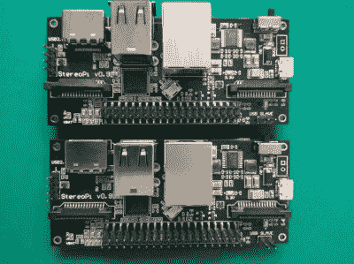

# 这个树莓派是一个立体相机，等等

> 原文：<https://hackaday.com/2018/12/30/this-raspberry-pi-is-a-stereo-camera-and-so-much-more/>

这些年来，我们已经推出了大量以树莓派为特色的项目，但是在这些项目中，除了少数几个例子之外，还缺少一些东西。Raspberry P Compute 模块是 Pi 的基本组成部分，其外形与 SODIMM 模块相似，旨在将 Pi 嵌入到商业产品中。然后看到[Eugene]的[StereoPi 项目](https://hackaday.io/project/162954-stereopi-diy-stereoscopic-camera-with-raspberry)令人耳目一新，这是一个接受计算模块并为两个 Raspberry Pi 相机提供接口的 PCB。

该板的特殊之处在于，除了立体声摄影所需的两个相机连接器外，它还提供了常规 Pi 上的所有接口，因此有熟悉的 40 针扩展接头以及 USB 和以太网端口。它有一些额外的功能，如基于引脚的电源连接器和开关。

 他们带着这个去哪里？到目前为止，我们已经看到了用 ROS (机器人操作系统)创建深度图的装备演示。但更有趣的是看到下面视频中显示的第三人称视角装备。你系上一个背包，将立体摄像机举过头顶，然后通过虚拟现实护目镜观看自己。本质上你变成了电子游戏。我们已经在之前看到了这个[演示，现在看起来你自己尝试一下会很容易，因为 StereoPi 已经宣布他们](https://hackaday.com/2014/07/02/third-person-perspective-is-guaranteed-to-mess-with-your-senses/)[准备众筹](https://www.crowdsupply.com/virt2real/stereopi)。

所以除了立体摄影，为什么这是特别的？答案是，它尽可能地接近对树莓 Pi 板的全新诠释，而不是来自 Pi 基金会本身。Pi 处理器不向第三方制造商提供，因此除了 Odroid W(产量非常有限)之外，我们从未见过兼容的 Raspberry Pi 的重要替代产品。这可以通过计算模块实现的想法是我们希望其他设计师可以采纳的，这可能会在树莓 Pi 的故事中开辟一条新的道路。

自 2014 年推出以来，Raspberry Pi 计算模块已经经历了两次迭代，但可能是由于零售 Raspberry Pi 的成本较低，除了几个[游戏机](https://hackaday.com/2017/06/02/game-boy-mod-uses-raspberry-pi-compute-module-3/)之外，我们在许多项目中没有看到它。如果这种板子的出现意味着我们会看到更多，那也不是什么坏事。

 [https://www.youtube.com/embed/KfIXS4B8_ac?version=3&rel=1&showsearch=0&showinfo=1&iv_load_policy=1&fs=1&hl=en-US&autohide=2&wmode=transparent](https://www.youtube.com/embed/KfIXS4B8_ac?version=3&rel=1&showsearch=0&showinfo=1&iv_load_policy=1&fs=1&hl=en-US&autohide=2&wmode=transparent)

 [https://www.youtube.com/embed/iKCUTXdq5lA?version=3&rel=1&showsearch=0&showinfo=1&iv_load_policy=1&fs=1&hl=en-US&autohide=2&wmode=transparent](https://www.youtube.com/embed/iKCUTXdq5lA?version=3&rel=1&showsearch=0&showinfo=1&iv_load_policy=1&fs=1&hl=en-US&autohide=2&wmode=transparent)

