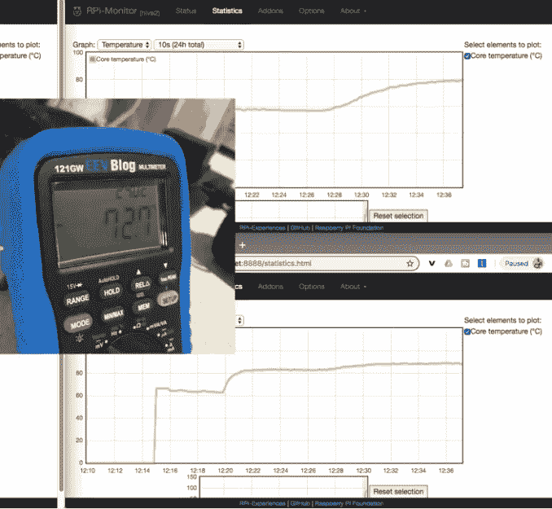

# 烤一个树莓派是魔法烟的配方吗？

> 原文：<https://hackaday.com/2019/01/10/is-baking-a-raspberry-pi-the-recipe-for-magic-smoke/>

不，Hackaday 还没有成为一个烘焙博客。我们在这里只是给你一点建议:如果[米克马克]给你一个他的新鲜出炉的 Pis，小心行事。虽然我们毫不怀疑他的厨房里会飘出一些有趣的味道，但这些不是你想要的美味馅饼。当计时器响起时，没有美味自制食物，[只有一把经历了异常艰难一天的覆盆子馅饼。](https://www.youtube.com/watch?v=fa2wVYt0DyE)

 为了恰当地解释一些树莓馅饼摆在饼干板上的奇怪景象，我们需要后退一步。[MickMake]最初是为了看看每个人都喜欢的 Linux SBC 如何应对澳大利亚的恶劣天气，并认为将它们设置在他汽车的仪表板上会是一个合适的折磨测试。但幸运的是，当他制作视频时，一场暴风雨袭来，气温降至“凉爽”的 30 摄氏度(86 华氏度)；基本上是世界底部的夹克天气。所以很自然地，他决定把它们放在烤箱里。

将一个原始 Pi、一个 Pi 2 和一对 Pi 3 放在一块绝缘板上，并在它们之间放置一个热电偶，以准确了解它们所经历的温度。除了通过网络监控他们，他还在每个 Pi 上添加了一个“心跳”LED，这样他就可以一眼看出他们中是否有人已经死了。好像这些可怜的小家伙们还没够倒霉似的，[米克马克]决定更进一步，在他们穿越哈迪斯的旅途中，在他们身上奔跑。

Pis 的实际额定温度高达 85C，所有实验参与者都没有遇到任何问题。在 87.3°C(~ 190°F)时，最初的 Pi 脱离了网络，但它的 LED 勇敢地闪烁着。在 105.7 摄氏度(~222 华氏度)时，它终于停止了呼吸，紧接着这对π3 在 112 摄氏度(233 华氏度)时爆发。Pi 2 继续战斗，但它正好在 119 C (246 F)的标记处倒下。

但是当他们冷静下来的时候呢？有点令人惊讶的是，[MickMake]成功地为所有四个备用电源供电，并且没有发现 Pis 的任何损坏，无论是物理损坏还是操作损坏。甚至连 SD 卡都幸存了下来，pi 也重新出现在网络上，并准备好迎接新一轮的*芯片大厨*。考虑到他们承受的温度比官方限定温度高三倍，这还算不错。

在你家的烤箱中测试电子设备可能看起来有点可疑，不可否认，我们可能会拒绝接下来几个冷冻披萨的[MickMake]运行，但这与如何进行适当的可靠性测试并没有太大的区别。

 [https://www.youtube.com/embed/fa2wVYt0DyE?version=3&rel=1&showsearch=0&showinfo=1&iv_load_policy=1&fs=1&hl=en-US&autohide=2&wmode=transparent](https://www.youtube.com/embed/fa2wVYt0DyE?version=3&rel=1&showsearch=0&showinfo=1&iv_load_policy=1&fs=1&hl=en-US&autohide=2&wmode=transparent)

【感谢 BaldPower 的提示。]