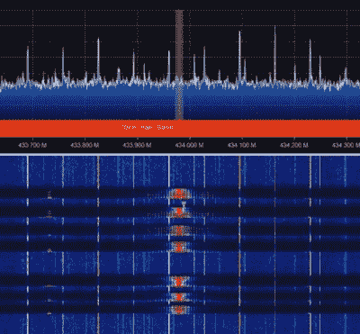

# 从清理架自动化你的家

> 原文：<https://hackaday.com/2019/01/19/automate-your-home-from-the-clearance-rack/>

假期后的一个月左右一直是在陡峭的间隙捡一些有趣的小工具的好时机，但随着装饰和灯光在过去几年变得越来越复杂，“圣诞清仓”架是有事业心的黑客绝对必须看到的。你可能会像[ModernHam]一样运气好，找到几包这种非常便宜的无线灯光控制器，只需要一点树莓皮和一小段电线，就可以很容易地将其接入家庭自动化系统的启动。

在休息后的视频中，[【modern ham】带着观众从头到尾的指挥这些廉价遥控插头](https://www.youtube.com/watch?v=wmHHsBAQyoY)的过程。从借助 FCC 数据库找到遥控器使用的频率开始，到使用 cron 安排 Pi 控制信号的传输结束，他的视频确实是一个信息财富。即使你没有这种特殊型号的远程插头，或者不一定想设置一个家庭自动化系统，这个视频中可能有一些元素，你仍然可以适应自己的项目。

 这个过程的第一步是弄清楚遥控器是如何与插头通信的。[ModernHam]注意到设备上没有列出频率，但使用他们的 FCC IDs，他能够找到相关信息。在美国，根据法律，像这样的设备必须有他们的 FCC IDs 可见(尽管他们可能在电池门后面)，所以可搜索的数据库是一个宝贵的工具，可以对一个记录不良的小工具进行一些基本的侦察。

然后，RTL-SDR 接收器用于微调从 FCC 文件中收集的信息。[ModernHam]发现所有四个远程插头的信号都是以相同的频率传播的，这使得控制它们变得更加容易。使用`rtl-sdr`命令，他能够捕获来自发射器的各种信号，并将它们保存到单独的文件中。然后，只需重放适当的文件，让插件执行您的命令。

当然，RTL-SDR 不能传输，所以在这最后一步中，您必须留下您的加密狗。幸运的是，您需要传输的只是由[f5eo]创建的 rpitx 包，以及支持的 Raspberry Pi 和连接到适当 GPIO 引脚的一小段电线。该包包含工具`sendiq`，可用于重放上一步中获得的原始捕获。通过一些脚本，可以很简单地自动执行这些传输，以您希望的方式从 Pi 控制远程插头。

RTL-SDR 博客也为类似这样的简单遥控设备整理了他们自己的指南[，我们甚至看到过](https://hackaday.com/2017/09/10/attack-some-wireless-devices-with-a-raspberry-pi-and-an-rtl-sdr/)[在过去使用类似的技术来对付汽车钥匙](https://hackaday.com/2017/10/18/exploiting-weak-crypto-on-car-key-fobs/)。一根电线和一些聪明的代码可以完成的事情令人惊讶。

 [https://www.youtube.com/embed/wmHHsBAQyoY?version=3&rel=1&showsearch=0&showinfo=1&iv_load_policy=1&fs=1&hl=en-US&autohide=2&wmode=transparent](https://www.youtube.com/embed/wmHHsBAQyoY?version=3&rel=1&showsearch=0&showinfo=1&iv_load_policy=1&fs=1&hl=en-US&autohide=2&wmode=transparent)

