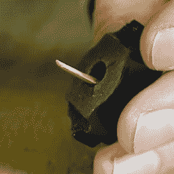

# 老式测试设备的克隆旋钮

> 原文：<https://hackaday.com/2019/01/20/cloning-knobs-for-vintage-testing-equipment/>

旋钮！闪亮的糖果色旋钮！skeuomorphism 的最后一站是智能灯开关！每个人都喜欢旋钮，但当你处理一个丢失了旋钮的老式设备时，更换它的可能性微乎其微。这就是[韦斯利·特里克]拿起一个老式菲尔科试管测试器时发生的事情。测试仪看起来很棒，但一个旋转开关的旋钮不见了。怎么办？[克隆一些旋钮](https://www.youtube.com/watch?v=aNBHtlhlHF4)！你只需要一些树脂和一点点硅胶。

 复制小块塑料或胶木的过程是相当标准和成熟的领域。去 Michaels 或者 Hobby Lobby，抓一些硅胶和树脂，做一个盒子，把你的零件放下来，用硅胶盖住，把零件拆下来，然后把树脂装进去。对于简单的零件，以及像旋钮这样的平底零件，这种方法非常有效。然而，这台老式 Philco 试管测试器上的旋钮有些奇怪。首先，它不适合标准的 1/4”轴，它有点大。也没有固定螺丝。相反，这个旋钮有一个冲压弹簧，它与这个旋转开关中的 D 轴的平面部分对齐。这意味着这个旋钮的副本不会对其他任何人有用，并且没有其他旋钮可以与这个试管测试器一起工作。

然而，一点聪明的工程将使这个旋钮的副本适合现有的开关。树脂固化后，[Wesley]钻出孔，然后用砂纸打磨一个销钉，使其适合 D 轴的平面。这花了一点时间，但旋钮最终安装到一个旋转开关上。对于硅树脂和树脂来说还不错。

您可以在下面查看整个构建过程。

 [https://www.youtube.com/embed/aNBHtlhlHF4?version=3&rel=1&showsearch=0&showinfo=1&iv_load_policy=1&fs=1&hl=en-US&autohide=2&wmode=transparent](https://www.youtube.com/embed/aNBHtlhlHF4?version=3&rel=1&showsearch=0&showinfo=1&iv_load_policy=1&fs=1&hl=en-US&autohide=2&wmode=transparent)

