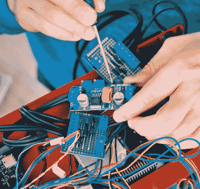

# 建造一台 3D 打印机，让你无处不在

> 原文：<https://hackaday.com/2019/01/21/building-a-3d-printer-that-goes-where-you-do/>

当拥有桌面 3D 打印机的最佳途径之一是自己用激光切割木头，再加上一些细绳来制作时，只要说你家里有一台，就会立即提高你的黑客街信誉。它甚至不需要特别好地工作(这很好，因为它很可能没有)，你只需要有一个。但是现在 3D 打印机变得如此普遍，游戏已经改变了。如果你想保持领先地位，你必须想出一个独特的钩子。

对我们来说幸运的是，[Thomas Sanladerer]在这里推动了桌面 3D 打印的现状。不满足于在车间里闲逛的 3D 打印机，他决定建造一台完全移动的 3D 打印机。对于一个花费大量时间旅行参加不同 3D 打印会议和展览的人来说，这实际上是一个非常方便的东西，但即使你不是 3D 打印 YouTube 名人，也可能有一些教训可以借鉴。

 鉴于市面上有大量非常流行的低成本 3D 打印机，一些人可能会惊讶于[Thomas]决定推出一款在这一点上几乎已经过时的打印机:PrinterBot Play。但正如他在休息后的视频中解释的那样，该剧的设计确实非常适合旅途中的生活。首先，由于其钢铁结构(可以说是过分了)，这是一款极其坚硬的打印机。与大多数当代 3D 打印机相比，这些打印机通常只不过是一堆铝挤压件和拉链，该游戏的方形设计还为额外的电子设备和线路提供了充足的空间

PrintrBot 最明显的附加功能是六个索尼 NP-F 相机电池，[Thomas]通过 3D 打印支架将其连接到打印机的背面，但内部也隐藏了相当多的硬件，以使机器摆脱交流电的束缚。电池组同时向 DC 升压转换器和 DC 稳压器供电，前者将电池电压提升至打印机电子设备和电机所需的 12 V，后者将电压降至运行 OctoPrint 的 Raspberry Pi 所需的 5 V。甚至还有一个充电控制器藏在里面，这不仅让他不用携带单独的充电器，而且让他在打印机启动和运行时给电池充电。

在软件方面，Raspberry Pi 被配置为 WiFi 接入点，因此即使没有现成的网络，也可以用智能手机控制 [OctoPrint。一个事实证明，当他在工作中带着打印机出去散步时。在没有任何现有基础设施的情况下控制打印机的能力，加上充电估计需要 6 小时的运行时间，这意味着无论[Thomas]身在何处，这款经过改进的打印机机器人都可以完成工作。](http://hackaday.com/2018/03/05/controlling-octoprint-on-the-go/)

黑客社区[对 PrintrBot 去年关闭的消息感到悲伤](http://hackaday.com/2018/07/19/a-farewell-to-printrbot/)，这是竞争日益激烈的桌面 3D 打印市场的不幸牺牲品。但是也许我们可以从这样一个事实中得到一些安慰，那就是[他们杰出的可破解的开源打印机仍然存在于像这样的项目中。](http://hackaday.com/2018/01/03/upgrading-a-3d-printer-with-octoprint/)

 [https://www.youtube.com/embed/gWiQJ-pqEOY?version=3&rel=1&showsearch=0&showinfo=1&iv_load_policy=1&fs=1&hl=en-US&autohide=2&wmode=transparent](https://www.youtube.com/embed/gWiQJ-pqEOY?version=3&rel=1&showsearch=0&showinfo=1&iv_load_policy=1&fs=1&hl=en-US&autohide=2&wmode=transparent)

【感谢 Nils Hitze 的提示。]