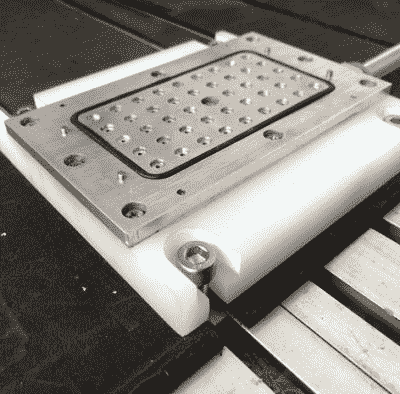

# DIY 真空工作台增强 PCB 铣削

> 原文：<https://hackaday.com/2019/01/28/diy-vacuum-table-enhances-pcb-milling/>

数控铣削覆铜板是一种有效的制造 PCB 的方法，它通过切除铜来形成迹线，而不是化学蚀刻掉，并且[loska]通过他的 [DIY PCB 真空工作台](https://www.thingiverse.com/thing:3320072)进一步改进了这一过程。这个小单元将容纳 100 x 80 mm 的板尺寸，这不是偶然选择的。这是 Eagle CAD 免费版可以处理的最大电路板尺寸。

当谈到铣削 PCB 时，双面胶带或脚趾夹是压住电路板的简单解决方案，但[loska]的装置在其附加功能背后有其用途。坚硬的铝制底座和真空有助于确保电路板被完全拉平并保持牢固，无需任何外部紧固件或粘合剂。如果在加工过程中使用切削液，它甚至是防液体的。此外，四个凸起的钉提供了一种可靠地制造双面 PCB 的方法。通过使用带孔的空白板来匹配钉，可以精确控制板的位置，确保板的背面被切割以匹配正面。如果需要，可以使用薄废纸板在单独的过程中钻孔。

一年比一年更容易加工覆铜板；如果你对这个想法感兴趣，我们自己的[Adil Malik]提供了[一个很好的工作流程和铣削代替蚀刻的要求的演示](https://hackaday.com/2018/01/04/guide-why-etch-when-you-can-mill/)。